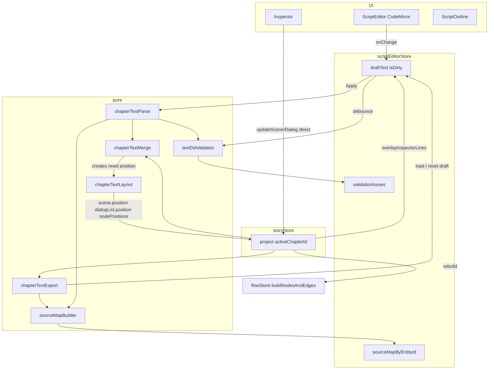

## Резюме

Текстовый режим строится на **двух буферах** (черновик CodeMirror ↔ `storyStore`) и **pure-пайплайне** parse → validate → merge → apply. Самые рискованные места: **сопоставление списков по номеру в заголовке**, **связи `(список N)` → UUID**, **рассинхрон Inspector vs черновик**, **удаление сущностей с рёбрами на графе**. Ниже — контракты модулей, алгоритмы и таблица edge cases с техническим решением.

**planStatus:** approved

**Спека:** `docs/web/text-editor-mode.md`, `05-plan-human.md`, `03-approved-spec.md`

---

## Идея реализации (одним абзацем)

Автор редактирует **строковый снимок активной главы** в `scriptEditorStore.draftText`. При **Apply** текст парсится в **дерево AST** (`ChapterTextTree`), валидируется, сливается с существующей главой в store через **merge по стабильным ключам** (номер списка в `## Список диалогов N`, порядок сцен), генерируются **патчи** только на текстовые поля; create/delete — через существующие `CreateService` / `DeletionService`. **Новые** сцены и списки получают координаты через **`chapterTextLayout`** (авто-сетка, как legacy import). **Inspector** пишет в store только для сущностей **с UUID в project**; read-only `;` строки — **overlay автоматом** после Inspector. Блоки только в черновике — Inspector недоступен до Apply. **Source map** строится при export и после успешного parse для jump-to-line из `AnalysisService`.

---

## Потоки данных



### Состояния черновика

| Состояние | `isDirty` | Переход |
|-----------|-----------|---------|
| `synced` | false | loadFromChapter, успешный Apply |
| `editing` | true | любое изменение в CodeMirror |
| `fileLoaded` | true | «Открыть файл» (ещё не Apply) |
| `staleMeta` | true/false | Inspector изменил store — overlay обновил `;` строки, сюжет не трогали |

---

## Модуль `services/chapterText/`

### `types.ts` — контракты

```ts
/** Узел AST после parse одной главы (без UUID до merge). */
interface ChapterTextTree {
  scenes: ParsedScene[];
  listNumberIndex: Map<number, ParsedDialogListRef>; // для (список N)
}

interface ParsedScene {
  title: string;
  line: number;           // строка ###
  lists: ParsedDialogList[];
}

interface ParsedDialogList {
  listNumber: number;     // из заголовка ## Список диалогов N
  title: string;
  line: number;
  statGates: StatGateLine[];
  dialogs: ParsedDialog[];
  variants: ParsedVariant[]; // вложены в dialog при parse
}

interface MergePlan {
  updates: EntityTextPatch[];
  creates: CreateEntitySpec[];
  deletes: { entityId: string; type: EntityType; reason: string }[];
  warnings: MergeWarning[];  // не блокируют, показываем UI
}

interface SourceMapEntry {
  entityId: string;
  entityType: SelectedItem;
  startLine: number;
  endLine: number;
}

interface ValidationIssue {
  code: ValidationCode;
  line: number;
  severity: 'blocker' | 'warning';
  message: string;
}
```

### `chapterTextParse.ts`

**Вход:** `draftText: string`, `project` (для имён персонажей, не для UUID).

**Выход:** `ChapterTextTree` + diagnostics.

**Правила parse (отличия от legacy `TextFormatService`):**

| Строка | Действие |
|--------|----------|
| `### Сцена: X` | новый `ParsedScene` |
| `## Список диалогов N` / `## Список N` | regex извлекает **N** → `listNumber` |
| `; stat:` / `; variant:` | в `statGates` текущего списка |
| `; …` (прочие) | **skip** — не в AST |
| `#Речь` / `#Мысль` / `#Мысли` | реплика |
| `#Выбор` + `- …` | реплика-выбор + variants |
| `(список N)` | в variant/link, N → позже resolve |

**Многострочные реплики:** строки до следующего `#` — continuation `dialog.text`.

**Алиас:** `#Мысли` → `replicaType: thought`, export всегда `#Мысль`.

### `chapterTextExport.ts`

```ts
exportChapterToText(chapterId: string, project: Project): string
```

1. Обход `chapter.sceneIds` в порядке store.
2. На каждую сцену: `### Сцена: {title}\n` + **inspector meta lines** (`buildSceneMetaLines(scene, project)`).
3. Обход `scene.dialogLists`: `## Список диалогов {n}\n` где **n** — стабильный номер (см. ниже).
4. Stat gates: `; stat:` / `; variant:` из store.
5. Диалоги / варианты — editable lines.
6. Параллельно вызывает `sourceMapBuilder` → возвращает `{ text, sourceMap }`.

**Стабильный номер списка:** при export присваиваем `1..K` по порядку в сцене; тот же номер embedded в заголовок. Merge **в первую очередь** матчит по `listNumber`, не по индексу.

**Номер списка в сцене vs глобально:** `(список N)` в canonical — **глобальный счётчик внутри главы** (как сейчас в `TextFormatService.dialogListCounter`). Export и validator используют **один счётчик** при обходе сцен сверху вниз.

### `chapterTextMerge.ts` — алгоритм

```text
mergeChapter(existingChapter, parsedTree, project) → MergePlan

Для каждой parsedScene по индексу i:
  existingScene = chapter.sceneIds[i] ?? null

  если existingScene:
    patch.textFields(scene.title)
    сохранить scene.uuid, все inspector-поля, nodePositions
  иначе:
    create Scene через CreateService (в памяти / patch)

  Для каждого parsedList в scene:
    existingList = findListByNumber(scene, parsedList.listNumber)
      ?? scene.dialogLists[i]  // fallback по индексу + warning MERGE_LIST_INDEX_FALLBACK

    если existingList:
      patch list title, statGates, dialogs...
    иначе:
      create DialogList

  lists в store, не упомянутые в parsedTree для этой сцены:
    → deletes (с confirm flag)

scenes в chapter, не упомянутые в parsedTree:
  → deletes (с confirm)

После merge диалогов:
  resolveVariantLinks(parsedTree, listNumberIndex, project)
    // (список N) → nextAvailableDialogListUUID на parent dialog / list
```

**Ключевое решение v1:** match списков по **`listNumber` из заголовка**; индекс — только fallback с `warning`.

**Патч текстовых полей диалога:** `text`, `characterId` (by name), `replicaType`, `variants[].text`, `notification`, `statChanges`.

**Не патчить:** `frameId`, `audioEvents`, `assetChanges`, `sceneType`, `backgroundImage`, edges сцен.

### `resolveVariantLinks` — проблемное место #1

После merge списков с известными UUID:

1. Построить `Map<listNumber, dialogListUuid>` по главе.
2. Для каждого variant с `(список N)`:
   - target = map.get(N)
   - если нет → validation error (уже на этапе VAL)
   - записать `variant` parent dialog → edge в `nextAvailableDialogListUUID` (как делает граф при connect)

**Риск:** legacy текст без `(список N)` — список не получает исходящих рёбер. Inline не ловит; `AnalysisService` → `DEAD_END`.

**Риск:** номер списка в заголовке изменили с `3` на `4` — это **новый** список + старый orphan. Warning `MERGE_LIST_NUMBER_CHANGED`.

---

## `chapterTextLayout.ts` — размещение сцен и списков на графе

Текст **не содержит координат**. После merge для каждой **новой** сущности вычисляем `position` и пишем в `scene.position`, `dialogList.position`, `project.nodePositions[uuid]`. Существующие узлы **не двигаем**.

### Модель React Flow (как сейчас)

```
Глава (activeChapter) — один холст

  [Scene A]  ──edge──►  [Scene B]  ──edge──►  [Scene C]     ← scene.position (absolute)
  ┌──────────────────┐
  │ DialogList 1     │  ← parentNode = Scene A, position relative
  │ DialogList 2 ────┼── edge (bottom→top) к DialogList 4
  └──────────────────┘
```

- **Сцена → сцена:** рёбра из `nextAvailableScenesUUID`. Текст **не создаёт** — автор тянет на графе после Apply.
- **Список → список:** рёбра из `nextAvailableDialogListUUID` после `resolveVariantLinks` (`(список N)`).

`buildNodesAndEdges(project, chapterId)` читает сохранённые позиции и строит `flowStore.nodes/edges`.

### Константы layout (из legacy `TextFormatService`)

| Константа | Значение | Назначение |
|-----------|----------|------------|
| `SCENE_HORIZONTAL_GAP` | 800 | шаг между сценами по X |
| `LIST_COLUMNS` | 5 | колонок сетки списков внутри сцены |
| `LIST_COL_WIDTH` | 260 | шаг по X внутри сцены |
| `LIST_ROW_HEIGHT` | 160 | шаг по Y внутри сцены |
| `LIST_TOP_OFFSET` | 140 | отступ списков от верха карточки сцены |

### API

```ts
interface LayoutContext {
  chapterId: string;
  project: Project;
  /** max scene.position.x среди сцен главы + gap, или 0 если пусто */
  nextSceneAnchor: { x: number; y: number };
}

/** Позиция для новой сцены в конце горизонтальной цепочки главы. */
function layoutNewScene(ctx: LayoutContext): { x: number; y: number };

/** Позиция для нового списка внутри сцены — сетка по текущему count. */
function layoutNewDialogList(
  scene: Scene,
  sceneAbsolutePosition: { x: number; y: number },
): { x: number; y: number };

/** После batch create: записать в scene + dialogList + nodePositions. */
function applyLayoutToCreates(
  plan: MergePlan,
  project: Project,
  chapterId: string,
): void;
```

### Правила v1

| Сущность | Уже есть в store | Создана текстом (Apply) |
|----------|------------------|-------------------------|
| **Сцена** | `position` / `nodePositions` **не меняем** | `x = maxSceneX + 800`, `y = anchorY` (обычно 0) |
| **Список** | position **не меняем** | `count = scene.dialogLists.length` до append; grid `(col, row)` |
| **Рёбра сцен** | сохраняем | **не добавляем** — автор на графе |
| **Рёбра списков** | сохраняем + `resolveVariantLinks` | из `(список N)` |

**`nextSceneAnchor`:** при создании первой сцены в пустой главе → `(0, 0)`. Каждая новая сцена → `lastX + 800`. Если автор уже двигал сцены — берём `max(scene.position.x)` по `chapter.sceneIds`.

**Списки внутри сцены:** позиция **относительная** (child node). `listIndex = scene.dialogLists.length` **до** push нового id:

```text
row = floor(listIndex / 5)
col = listIndex % 5
x = col * 260
y = 140 + row * 160
```

### Пример: canonical из текста (3 сцены, 2 списка в первой)

**После Apply (авто-layout):**

```text
X →
[Scene1 @ 0,0]     [Scene2 @ 800,0]     [Scene3 @ 1600,0]
 ├─ List1 (0,140)   ├─ List1 (0,140)
 └─ List2 (260,140)  └─ ...
     edge от (список 2) ──────────────► List2 в Scene1 или другой сцене
```

Рёбра **между Scene1→Scene2→Scene3** — **нет**, пока автор не соединит на графе.

### Пример: правка реплики (существующий проект)

Merge по UUID / listNumber → **creates пустой** → layout **не вызывается** → карточки на месте.

### Пример: новый `## Список диалогов 4` в существующей сцене

1. merge create DialogList
2. `layoutNewDialogList` → slot по `dialogLists.length` (например 4-й → col=3, row=0)
3. Может **наложиться** на вручную подвинутый список — v1 допустимо; автор перетаскивает на графе

### Вызов в pipeline

```text
applyChapterText():
  plan = mergeChapter(...)
  applyLayoutToCreates(plan.creates, ...)   // только creates
  applyPatches(plan.updates)
  resolveVariantLinks(...)
  buildNodesAndEdges(activeChapterId)
  flowStore.setNodes/setEdges
```

### Edge cases layout

| # | Ситуация | Поведение |
|---|----------|-----------|
| L1 | Первая глава, первый Apply | сцены с x=0, 800, 1600… |
| L2 | Новая сцена при уже разъехавшихся вручную | anchor = max X, не last+800 от «дыры» |
| L3 | 6-й список в сцене | row=1, col=0 (вторая строка сетки) |
| L4 | Импорт в пустую главу | все creates → full layout pass |
| L5 | Delete сцены | позиции остальных **не сжимаем** (как сейчас на графе) |
| L6 | Переключение Граф после Apply | `fitView` опционально на новых nodes — **не в v1** |

### Тесты `chapterTextLayout.test.ts`

- 3 новые сцены → x = 0, 800, 1600
- 6 новых списков в одной сцене → row/col grid
- create при существующей сцене с position (100, 50) → новый список relative, scene absolute unchanged
- merge update-only → layout functions not called

**Ссылка на legacy:** `TextFormatService.ts` строки 116–132 (сцены), 739–752 (списки) — переносим без изменения чисел в v1.

---

### `textDslValidator.ts`

Два прохода:

**Проход A — line scanner (без полного merge):**
- структура заголовков
- orphan lines
- duplicate `listNumber` в AST
- unknown characters
- stat gate syntax

**Проход B — link resolver (dry):**
- собрать все `listNumber` из `##`
- проверить каждый `(список N)` ∈ known numbers
- `#Выбор` имеет ≥1 `-`

`Apply` вызывает оба; blocker → `MergePlan` не строится.

### `sourceMapBuilder.ts`

На export и на parse (после merge plan для новых UUID — только post-apply rebuild):

| Сущность | startLine |
|----------|-----------|
| scene | строка `###` |
| dialogList | строка `##` |
| dialog | строка `#Речь` / `#Выбор` |
| variant | строка `-` |

`sourceMapByEntityId: Record<string, number>` в store.

**Проблемное место #2:** после Apply UUID новых сущностей меняются — **обязательный** `exportChapterToText` → replace draft **или** rebuild map из post-apply tree. Рекомендация: **после успешного Apply** — silent re-export в draft (сохранить cursor line) + `isDirty=false`.

### `statGateSyntax.ts`

```text
; stat: {statName} {op} {number}     → minimumRequiredStats
; variant: {variantTextOrId}         → requiredSelectedVariants (match by text in project)
```

Parse variant by text: ищем variant в project с таким `text` (ambiguous → warning).

---

## `storyStore` — `applyChapterText`

```ts
applyChapterText(chapterId: string, draftText: string): ApplyResult
```

1. `parsed = chapterTextParse(draftText, project)`
2. `issues = textDslValidator(parsed, project, chapterId)` — если blockers → throw/return
3. `plan = chapterTextMerge(chapter, parsed, project)`
4. Если `plan.deletes` с `requiresConfirm` → UI уже отфильтровал; store получает только подтверждённый plan
5. Транзакция в Zustand (один `set`):
   - `updateScene` / `updateDialog` / … для patches
   - `CreateService` batch для creates
   - `DeletionService` для deletes
6. `resolveVariantLinks` + обновить `nextAvailableDialogListUUID` / flow edges
7. `buildNodesAndEdges(activeChapterId)` — **критично**, иначе граф пустой
8. `isDirty = true` на storyStore

**Не трогать:** другие chapters, `userStats`, `book`, monetization.

---

## `scriptEditorStore`

```ts
interface ScriptEditorState {
  draftText: string;
  isDirty: boolean;
  sourceMapByEntityId: Record<string, number>;
  validationIssues: ValidationIssue[];
  chapterIdLoaded: string | null;
  cursorLine: number;

  loadFromChapter(chapterId: string): void;
  setDraftText(text: string): void;
  applyDraft(): Promise<ApplyResult>;
  resetDraft(): void;
  overlayInspectorMetaLines(entityId: string): void;
  scrollToEntity(entityId: string): void;
}
```

### `loadFromChapter`

- `exportChapterToText` → set draft, `isDirty=false`, build source map.
- Вызывается при: вход в `viewMode=script`, смена `activeChapterId` (если dirty → dialog).

### `overlayInspectorMetaLines`

Когда Inspector вызвал `updateScene` / `updateDialog` (сущность **уже в store**):

1. Найти диапазон строк сущности в draft через `sourceMapByEntityId`.
2. Заменить **только** строки, matching `/^; /`, в этом диапазоне (до первого `#` / `##` child).
3. **Не** ставить `isDirty=true` если менялись только meta-строки.

### Inspector: сущность ещё не в store

```ts
function canOpenInspectorForSelection(entityId: string | null): boolean {
  return entityId != null && project.scenes[entityId] != null
    || project.dialogLists[entityId] != null
    || project.dialogs[entityId] != null;
}
```

| Состояние | Inspector | Поведение |
|-----------|-----------|-----------|
| UUID в store (после load / Apply) | ✅ активен | `updateScene` / `updateDialog` → store → **auto overlay** `;` строк |
| Выбор по outline/строке, блок **только в draft** (dry-parse, нет UUID) | ❌ disabled | `ScriptInspectorPlaceholder`: «Примените текст (Apply), чтобы настроить фон, аудио и визуал» |
| После успешного Apply | source map + UUID | Inspector разблокируется для новых сущностей |

Та же модель, что у текста: **сначала Apply создаёт сущность в store**, потом inspector-only поля.

**Проблемное место #3:** если автор редактировал `; stat:` вручную и параллельно Inspector — last-write-wins на Apply. Gates в v1 только в тексте; Inspector Requirements tab не дублируем в текст live.

### Переключение viewMode (dirty guard)

```ts
async function tryLeaveScriptMode(): Promise<'stay' | 'applied' | 'discarded'> {
  if (!isDirty) return 'discarded';
  // modal: Apply | Discard | Cancel
}
```

---

## UI — `ScriptEditor` + CodeMirror

### Extensions

| Extension | Назначение |
|-----------|------------|
| `lineNumbers` | gutter |
| `readOnlyRanges` | Decoration на строках `/^; (?!stat:|variant:)/` — meta read-only |
| `editableGates` | `; stat:` / `; variant:` редактируемы |
| `validationDecorations` | Issue[] → underline |
| `entityHighlight` | подсветка блока выбранной сущности |

**Read-only enforcement:** `EditorView.domEventHandlers` — `beforeinput` на read-only range → prevent. Копипаст meta-строк допустим.

### Outline → selection

`ScriptOutline` держит дерево из **последнего успешного parse dry-run** (debounced). Клик → `scrollToLine` + `select(entityId, type)`.

**Проблемное место #4:** outline может отставать от невалидного текста — показываем последний valid parse или серый «устарело».

### Панель проблем

`ScriptIssuesPanel` — рендер `validationIssues`; видима если `issues.length > 0` (решение human plan #4 default). Клик → `scrollToLine`.

### `AnalysisResultsModal`

```ts
function onJumpToError(elementId: string) {
  if (viewMode !== 'script') setViewMode('script');
  const line = scriptEditorStore.sourceMapByEntityId[elementId];
  if (line == null) {
    // entity только в черновике — toast «Сначала Apply»
    const dry = chapterTextParse(draftText);
    line = approximateLineFromDryParse(dry, elementId); // best effort
  }
  scriptEditorStore.scrollToEntity(elementId);
}
```

---

## Edge cases — техническая таблица

| # | Ситуация | Детекция | Поведение | Риск если сделать иначе |
|---|----------|----------|-----------|-------------------------|
| E1 | Dirty + switch to Graph | `isDirty` | Modal Apply/Discard/Cancel | потеря правок или рассинхрон |
| E2 | Вставка `##` в середину | `listNumber` set ≠ store | Warning + merge by number; orphan old number | тихая перезапись чужих реплик |
| E3 | Удалили сцену | merge deletes | Confirm if `nextAvailableScenesUUID` in/out | битые рёбра на графе |
| E4 | Удалили список с исходящими edges | merge deletes | Confirm + `DeletionService` чистит edges | ghost edges в flowStore |
| E5 | `(список N)` на несуществующий N | validator pass B | blocker Apply | runtime тупик |
| E6 | Два `## Список диалогов 3` | parser | blocker duplicate | ambiguous merge |
| E7 | Персонаж не в project | validator | blocker | пустой спрайт в RN |
| E8 | Inspector изменил фон, draft dirty | store subscription | `overlayInspectorMetaLines` | автор видит устаревший `; фон:` |
| E9 | Apply создал новые UUID | post-apply | re-export draft + remap sourceMap | jump-to-line на старые id |
| E10 | `S` при dirty draft | hotkey handler | modal «Apply перед сохранением?» | cloud без текстовых правок |
| E11 | Смена главы при dirty | `activeChapterId` watch | тот же modal | глава A правки применятся к B |
| E12 | Файл с `#### Глава 2` в главе 1 | parse | strip `####` или warn | мусор в AST |
| E13 | Импорт новой главы multi-#### | menu action | parse only selected chapter block | затирание проекта |
| E14 | Пустая глава + canonical | merge all creates | OK | — |
| E15 | Character editor | `setViewMode('characterEditor')` | force `flow` or block if dirty | script UI без персонажа |
| E16 | React Flow hotkey Delete в script | existing guard | textarea focus → не блокировать | — |
| E17 | `listNumber` gap (1,3, no 2) | validator | warning non-contiguous | `(список 2)` confusion |
| E18 | Variant statChanges invalid stat | validator | blocker | RN ignore |
| E19 | Reorder scenes `###` blocks | merge by scene index | **scenes match by index only** — warn REORDER_SCENES | scene inspector data на «чужой» сцене |
| E20 | Concurrent tab | — | last save wins (как сейчас) | — |
| E21 | Новая сцена без рёбер | после Apply | изолированный узел на max X | автор не понимает порядок сцен |
| E22 | 6+ списков в сцене | layout grid | вторая строка, возможен overlap | ручной drag |
| E23 | Новый список + ручной layout | layout by count | может наехать на соседа | drag на графе |

### E19 — отдельно: сцены только по индексу

Списки — по номеру в заголовке. **Сцены** — только по порядку `###` (v1). Перестановка блоков сцен меняет привязку фонов. Mitigation: warning `REORDER_SCENES` при diff заголовков scene.title vs store order; future: `### Сцена [1]: Name`.

---

## Проблемные места (приоритет для ревью)

| Приоритет | Место | Суть | Mitigation в v1 |
|-----------|-------|------|-----------------|
| P0 | `(список N)` → UUID | текстовые связи должны стать рёбрами graph | `resolveVariantLinks` + unit tests |
| P0 | post-Apply source map | UUID меняются | silent re-export draft |
| P0 | `buildNodesAndEdges` после apply | граф не обновится | вызов в `applyChapterText` |
| P1 | merge list by number | вставка списков | номер в `##`; warning на fallback |
| P1 | Inspector vs draft meta | два writer | overlay meta lines; gates только в тексте |
| P1 | delete confirm | каскад | reuse `DeletionService` + graph edge cleanup |
| P2 | scene reorder | index-only merge | warn; не редактировать порядок сцен в v1 help |
| P2 | variant match by text для `; variant:` | ambiguous names | warning + prefer UUID in export v1.1 |
| P2 | новые сущности без позиций | nodePositions | **`chapterTextLayout`** при creates |

---

## Фазы implement (с зависимостями)

```
F1 pure: types, parse, export, merge, **layout**, validator, sourceMap + tests
    ↓
F2 storyStore.applyChapterText + resolveVariantLinks + flow rebuild
    ↓
F3 scriptEditorStore + export/load (read-only UI, no Apply)
    ↓
F4 CodeMirror + readOnlyRanges + issues panel
    ↓
F5 Apply + dirty guards + post-apply re-export
    ↓
F6 ViewModeToggle + EditorLayout + Inspector in script
    ↓
F7 Analysis jump-to-line
    ↓
F8 file import + import new chapter + remove ImportTextModal
```

---

## Тесты (обязательные кейсы)

### `chapterTextMerge.test.ts`

- happy path: одна реплика, UUID сохранён
- list by number: вставка `## Список 2` не затирает list 3
- inspector fields preserved on scene/dialog
- delete list → plan.deletes contains uuid
- create list → plan.creates
- `(список 2)` resolves after merge

### `textDslValidator.test.ts`

- unknown list number
- duplicate list number
- unknown character
- orphan line

### `chapterTextExportParse.roundtrip.test.ts`

- editable roundtrip
- inspector fields unchanged after apply
- `#Мысль` / `#Мысли` alias

### `chapterTextLayout.test.ts`

- 3 scenes horizontal spacing
- dialog list grid 5+1
- no layout on update-only merge

### `overlayInspectorMeta.test.ts` (optional)

- replace only `;` lines in scene block

---

## Файлы (итоговый список)

| Файл | Новый/изм. |
|------|------------|
| `services/chapterText/types.ts` | новый |
| `services/chapterText/chapterTextParse.ts` | новый |
| `services/chapterText/chapterTextExport.ts` | новый |
| `services/chapterText/chapterTextMerge.ts` | новый |
| `services/chapterText/chapterTextLayout.ts` | новый |
| `services/chapterText/textDslValidator.ts` | новый |
| `services/chapterText/sourceMapBuilder.ts` | новый |
| `services/chapterText/statGateSyntax.ts` | новый |
| `services/chapterText/resolveVariantLinks.ts` | новый |
| `services/chapterText/index.ts` | barrel |
| `services/chapterText/__tests__/*` | новый |
| `services/TextFormatService.ts` | facade → chapterText |
| `store/scriptEditorStore.ts` | новый |
| `store/slices/chapterTextSlice.ts` | новый |
| `store/storyStore.ts` | applyChapterText |
| `components/script/ScriptEditor.tsx` | новый |
| `components/script/ScriptOutline.tsx` | новый |
| `components/script/ScriptIssuesPanel.tsx` | новый |
| `components/script/ScriptInspectorPlaceholder.tsx` | новый |
| `components/script/useScriptEditorExtensions.ts` | новый |
| `components/editor/ViewModeToggle.tsx` | новый |
| `pages/EditorLayout.tsx` | script + inspector |
| `components/AnalysisResultsModal.tsx` | jump |
| `store/analysisStore.ts` | jump callback |
| `components/projectTree/ProjectTree.tsx` | убрать modal |
| `components/ImportTextModal.tsx` | **удалить** |
| `services/ParserText.ts` | **удалить** |

---

## Решения implement (plan approved, 2026-06-29)

| Вопрос | Решение |
|--------|---------|
| Merge списков | по **номеру в `## Список диалогов N`** |
| Merge сцен | по **индексу** + warn при reorder |
| Inspector | store **сразу**, если UUID в project; **disabled до Apply**, если только в черновике |
| Meta lines refresh | **автоматически** после Inspector (`overlayInspectorMetaLines`) |
| Панель ошибок | **только при `issues.length > 0`** |
| После Apply | **re-export draft** + remap source map |
| `S` при dirty | modal «Apply?» |

---

## Глоссарий

| Термин в коде | По-русски | Где живёт |
|---------------|-----------|-----------|
| `ChapterTextTree` | AST главы из текста | `chapterText/types.ts` |
| `MergePlan` | План create/update/delete | `chapterTextMerge.ts` |
| `listNumber` | Номер в `## Список диалогов N` | parse + merge key |
| `resolveVariantLinks` | `(список N)` → UUID рёбер | `resolveVariantLinks.ts` |
| `overlayInspectorMetaLines` | Обновить `;` строки в draft | `scriptEditorStore.ts` |
| `readOnlyRanges` | CodeMirror: нельзя edit meta | `useScriptEditorExtensions.ts` |
| `ApplyResult` | success / issues / needsConfirm | `chapterTextSlice.ts` |
| `REORDER_SCENES` | Warning при смене порядка `###` | merge warnings |
| `chapterTextLayout` | Авто-позиции новых scene/list на графе | `chapterTextLayout.ts` |
| `SCENE_HORIZONTAL_GAP` | 800px между новыми сценами | layout constants |
| `ScriptInspectorPlaceholder` | Заглушка «Сначала Apply» | `components/script/ScriptInspectorPlaceholder.tsx` |
| `canOpenInspectorForSelection` | Есть ли UUID сущности в store | `scriptEditorStore.ts` |
| `parentNode` | Список — ребёнок сцены на холсте | React Flow |
