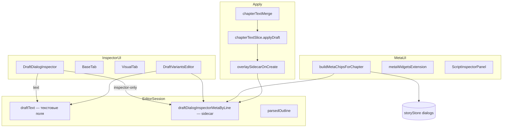

## Резюме

Web-only: sidecar `draftDialogInspectorMetaByLine` в `scriptEditorStore`, полный `DraftDialogInspector`, meta-чипы store+sidecar, overlay при Apply create. **~15–20 файлов**, pure logic в `services/chapterText/` + unit tests (vitest).

**planStatus:** draft

**Спека:** @see `docs/web/text-editor-mode.md`, `03-approved-spec.md`, `docs/specs/gameplay/entities/Диалог.md`

**Scope:** `web/editor-app/src/**` — script mode, chapterText, inspectors. @see `.cursor/rules/web.mdc`, `common.mdc`.

---

## Архитектура



**Слои (web):** pure services (`chapterText/`) → Zustand stores → React components. Без Supabase migrations.

---

## Фазы implement

| # | Блок | Ключевые файлы | AC (из spec) |
|---|------|----------------|--------------|
| 0 | Типы + pure helpers | `draftDialogMeta.ts` (new) | Sidecar shape, merge view-model, rekey |
| 1 | scriptEditorStore | `scriptEditorStore.ts` | `draftDialogInspectorMetaByLine`, patch/clear/rekey |
| 2 | Rekey pipeline | `scriptEditorStore.setDraftText`, `rekeyDraftDialogMeta.ts` | Meta не теряется при сдвиге строк |
| 3 | Draft inspector | `DraftDialogInspector.tsx`, `draftDialogPatch.ts` | Base+Visual; patch DSL vs sidecar |
| 4 | Draft variants | `DraftVariantsEditor.tsx` (new) или mode в `VariantsEditor` | «+» работает; premium в sidecar |
| 5 | Meta chips | `buildMetaChips.ts`, `metaWidgetsExtension.ts`, `ScriptInspectorPanel.tsx` | Draft lines + audio; refresh all fields |
| 6 | Apply overlay | `chapterTextSlice.ts`, `applyDraftSidecarOverlay.ts` (new) | Create Dialog с полным meta |
| 7 | Tests + smoke | `__tests__/` | rekey, overlay, chips, patch |

---

## Изменения по слоям

### 0. Типы и pure logic (new module)

**`web/editor-app/src/services/chapterText/draftDialogMeta.ts`**

```typescript
/** Стабильный ключ блока реплики для rekey (не зависит от line). */
export interface DraftDialogBlockKey {
  sceneIndex: number;
  listIndexInScene: number;
  dialogIndexInList: number;
}

/** Inspector-only + premium вариантов; живёт в scriptEditorStore. */
export interface DraftDialogInspectorMeta {
  frameId?: string;
  textWeight?: TextWeight;
  textStyle?: TextStyle;
  audioEvents?: DialogAudioEvent[];
  characterPosition?: CharacterPosition;
  cameraPositionX?: number;
  assetChanges?: AssetChange[];
  /** premium по индексу варианта в parse AST */
  variantPremium?: Array<{ isPremium?: boolean; premiumCategory?: string | null }>;
}

export function mergeDialogViewModel(
  parsed: ParsedDialog,
  project: Project,
  sidecar?: DraftDialogInspectorMeta,
): Dialog;

export function rekeyDraftDialogMeta(
  oldOutline: ChapterTextTree,
  newOutline: ChapterTextTree,
  oldMetaByLine: Record<number, DraftDialogInspectorMeta>,
): Record<number, DraftDialogInspectorMeta>;

export function resolveDialogHeaderLine(
  outline: ChapterTextTree,
  blockKey: DraftDialogBlockKey,
): number | null;

export function overlaySidecarOnDialog(
  dialog: Dialog,
  meta: DraftDialogInspectorMeta | undefined,
): Dialog;
```

**Rekey:** для каждой реплики в `newOutline` вычислить `DraftDialogBlockKey` → найти meta из `oldMetaByLine` через line в `oldOutline` с тем же key → записать на `newLine`.

**Тесты:** `draftDialogMeta.test.ts` — rekey при insert above, delete block, два диалога в одном списке.

---

### 1. scriptEditorStore

**`web/editor-app/src/store/scriptEditorStore.ts`**

| Action | Назначение |
|--------|------------|
| `draftDialogInspectorMetaByLine: Record<number, DraftDialogInspectorMeta>` | state |
| `patchDraftDialogMeta(line, patch)` | partial merge sidecar + `notifyInspectorMetaChanged` |
| `clearDraftDialogMeta(lines: number[])` | при delete блока |
| `rekeyDraftDialogMetaAfterParse(newOutline)` | вызывается из `setDraftText` после `chapterTextParse` |

`loadFromChapter` / `resetDraft` / успешный `applyDraft` → **очистить** sidecar (или rekey после apply если draft пересобирается).

`setDraftText` flow:

1. parse new outline
2. `rekeyDraftDialogMeta(oldOutline, newOutline, metaByLine)`
3. assign `draftText`, `parsedOutline`, updated meta map

---

### 2. DraftDialogInspector

**`web/editor-app/src/components/script/DraftDialogInspector.tsx`**

- Убрать заглушки Visual / сократить баннер.
- `dialog` = `mergeDialogViewModel(parsed, project, metaByLine[line])`.
- `handleUpdate`:
  - `text`, `characterId`, `replicaType` → `patchDraftDialogAtLine` (как сейчас)
  - остальное → `patchDraftDialogMeta(line, patch)`
- `handleCharacterChange` → DSL patch + **clear `assetChanges`** в sidecar
- VisualTab: передать `onToggleAsset` → patch `assetChanges` в sidecar (копия логики `toggleDialogAsset`, без store)
- `DialogScenePreview`: для draft передать `dialog` из merged view-model (не `dialogId` store); при необходимости prop `dialogOverride` в preview

**`draftDialogPatch.ts`:** без изменений контракта DSL-патча; опционально export `parsedDialogToViewModel` → использовать из `draftDialogMeta.mergeDialogViewModel`.

---

### 3. Draft variants

**Вариант A (предпочтительный):** `DraftVariantsEditor.tsx`

- Props: `line`, `parsed`, `draftText`, `setDraftText`, `sidecar`, `patchMeta`
- Add: append `#Выбор` if needed + `- Новый вариант\n` в DSL
- Update text/stat/notification: patch DSL lines (reuse export format helpers)
- Delete: splice variant lines from DSL
- Premium: `patchMeta({ variantPremium: [...] })`

**Не вызывать** `useStoryStore.addVariant` для `uuid === 'draft'`.

BaseTab: `{isMainCharacter && (isDraft ? <DraftVariantsEditor /> : <VariantsEditor />)}` — или prop `variantPersistence="draft"|"store"` на VariantsEditor.

---

### 4. Meta chips

**`buildMetaChips.ts`**

- `buildDialogMetaChips` — добавить **audioEvents** (labels как у scene BGM: asset name / basename).
- `buildMetaChipsForChapter(project, sourceMap, options?)`:
  - UUID dialogs — как сейчас
  - **+** для каждой реплики в `parsedOutline` без entityId в source map (или `isDirty` + line not in map): line из AST → sidecar → chips с synthetic `entityId: draft-dialog:{line}`

**`metaWidgetsExtension.ts`**

- Принять getter sidecar + parsedOutline из store closure в `ScriptEditor`.
- Click chip `draft-dialog:*` → `selectionStore.setSelectedId`.

**`ScriptInspectorPanel.tsx`**

- Расширить `inspectorMetaKey` для dialog: `frameId`, `textWeight`, `textStyle`, `characterPosition`, `cameraPositionX`, `assetChanges` (serialized length/hash), `audioEvents`.
- Для `isDraftDialogId(selectedId)`: `useEffect` → `notifyInspectorMetaChanged` при изменении sidecar slice (subscribe `draftDialogInspectorMetaByLine[line]` или version counter).

---

### 5. Apply overlay

**`web/editor-app/src/services/chapterText/applyDraftSidecarOverlay.ts`**

При `applyDraft` в `chapterTextSlice`, **после** построения `Dialog` для create:

1. `resolveDialogHeaderLine(parsedOutline, { sceneIndex, listIndex, dialogIndex })`
2. `meta = get().draftDialogInspectorMetaByLine[line]`
3. `overlaySidecarOnDialog(dialog, meta)` — frame, weight, style, audio, position, camera, assets
4. Для variants: merge `variantPremium[i]` → `isPremium`, `premiumCategory`

**Не менять** `patchDialog` updates для existing UUID.

После success apply: clear sidecar или rebuild from new export (lines now in source map).

---

### 6. Регрессия UUID

Smoke (manual / один test):

- Export chapter → edit text of existing dialog → Apply → `frameId` / `audioEvents` в store **не изменились**
- Edit frame in inspector for UUID dialog → chips refresh with audio label

---

## Новые / затронутые файлы

| Файл | Действие |
|------|----------|
| `services/chapterText/draftDialogMeta.ts` | **new** |
| `services/chapterText/applyDraftSidecarOverlay.ts` | **new** |
| `services/chapterText/__tests__/draftDialogMeta.test.ts` | **new** |
| `services/chapterText/__tests__/applyDraftSidecarOverlay.test.ts` | **new** |
| `components/script/DraftVariantsEditor.tsx` | **new** (или extend VariantsEditor) |
| `store/scriptEditorStore.ts` | extend |
| `components/script/DraftDialogInspector.tsx` | refactor |
| `components/script/meta/buildMetaChips.ts` | extend |
| `components/script/ScriptInspectorPanel.tsx` | extend |
| `components/script/ScriptEditor.tsx` | pass sidecar to meta extension |
| `components/script/extensions/metaWidgetsExtension.ts` | draft lines |
| `store/slices/chapterTextSlice.ts` | overlay on create |
| `components/inspectors/dialog/DialogScenePreview.tsx` | optional `dialogOverride` |
| `services/chapterText/index.ts` | re-exports |

---

## Тесты (vitest, pure)

| Модуль | Кейсы |
|--------|-------|
| `rekeyDraftDialogMeta` | insert line above; delete dialog; reorder within list |
| `mergeDialogViewModel` | sidecar + parsed defaults |
| `overlaySidecarOnDialog` | all inspector fields + variant premium |
| `buildMetaChipsForChapter` | draft line with sidecar; UUID with audioEvents |
| `patchDraftDialogMeta` | store action (integration light) |

Запуск: `cd web/editor-app && npm test -- draftDialog`

---

## Supabase / mobile

- **Миграции:** нет
- **Mobile:** нет

---

## Глоссарий

| Термин в коде | По-русски | Где живёт |
|---------------|-----------|-----------|
| `draftDialogInspectorMetaByLine` | Sidecar: line → inspector-meta | `scriptEditorStore` |
| `DraftDialogInspectorMeta` | Shape sidecar-объекта | `draftDialogMeta.ts` |
| `DraftDialogBlockKey` | Стабильный id блока для rekey | `draftDialogMeta.ts` |
| `rekeyDraftDialogMeta` | Перепривязка sidecar после parse | pure fn |
| `mergeDialogViewModel` | Parsed + sidecar → `Dialog` для UI | pure fn |
| `overlaySidecarOnDialog` | Sidecar → `Dialog` при create | apply pipeline |
| `draft-dialog:{line}` | Selection id черновика | `resolveSelectionFromOutline.ts` |
| `parsedDialogToViewModel` | Dialog из AST без sidecar | `draftDialogPatch.ts` |
| `notifyInspectorMetaChanged` | Инкремент `metaWidgetsVersion` | `scriptEditorStore` |
| `presentedSourceMapByEntityId` | UUID → line в presented text | `scriptEditorStore` |
| `buildDialogMetaChips` | Labels для чипов реплики | `buildMetaChips.ts` |
| `chapterTextMerge` | Pure merge plan | `chapterTextMerge.ts` |
| `applyDraft` | Запись merge в storyStore | `chapterTextSlice.ts` |

---

## Риски implement

| Риск | Митигация |
|------|-----------|
| Rekey коллизии при дублирующихся репликах | Key включает **dialogIndexInList**, не только text |
| `DialogScenePreview` читает store по uuid | Prop `dialogOverride` для draft |
| `CreateService.createVariant` при draft leak | Guard в DraftVariantsEditor; assert uuid !== `'draft'` |
| Sidecar stale после Apply | Clear on successful apply |

---

## Checklist перед merge

- [ ] AC из `03-approved-spec.md` — все пункты
- [ ] Vitest green для новых модулей
- [ ] Smoke: новая реплика end-to-end до Apply и после
- [ ] Smoke: UUID-реплика без регрессии inspector-only
- [ ] `@see docs/web/text-editor-mode.md` на новых модулях
- [ ] JSDoc на exported symbols (`common.mdc`)
