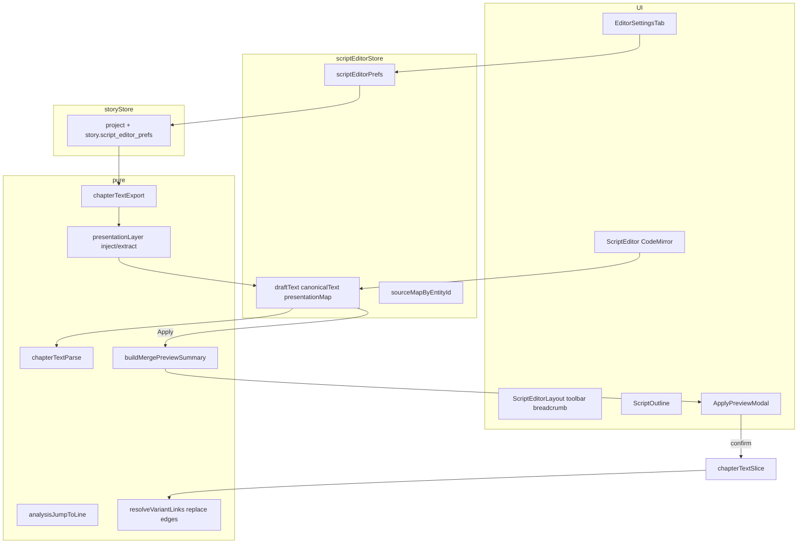

## Резюме

Scenarist UX — слой поверх v1 text mode: **CodeMirror extensions** (подсветка, autocomplete, widgets, fold), **presentation layer** (spacing), **prefs pipeline** (Supabase JSONB → mapper → settings tab), **narrator parse/export**, **preview diff**, плюс закрытие parent **#8/#9**. ~25–35 файлов в `web/editor-app/`, pure-логика в `chapterText/*` + unit-тесты.

**planStatus:** draft

**Спека:** `03-approved-spec.md`, `05-plan-human.md`, `docs/web/text-editor-mode.md#scenarist-ux`

---

## Архитектура



**Правило слоёв (web):** pure helpers в `services/chapterText/` и `utils/`; Zustand `scriptEditorStore` + `storyStore`; UI только в `components/script/` и `components/settings/`. `@see docs/web/text-editor-mode.md`.

---

## Фазы implement

| # | Блок | Зависимости | AC |
|---|------|-------------|-----|
| 0 | Parent #8 jump dirty, #9 replace edges | — | review #8, #9 |
| 1 | Narrator parse/export + tests | 0 | narrator AC |
| 2 | `script_editor_prefs` DTO/mapper/load/save | migration (sync) | prefs persist |
| 3 | Editor settings tab + toolbar link | 2 | settings UI |
| 4 | CM syntax highlight + gate highlight | — | highlighting AC |
| 5 | Meta widgets (scene/dialog) | 4 | widgets AC |
| 6 | Autocomplete | 1, 4 | autocomplete AC |
| 7 | Presentation layer spacing | 2, EXP | spacing AC |
| 8 | Breadcrumb + text→outline sync + fold | SM | navigation AC |
| 9 | Preview diff modal | merge plan types | preview AC |
| 10 | Toolbar font slider | 2, 4 | font slider AC |
| 11 | Integration tests + review pass | all | full AC |

Фазы 4–6 можно частично параллелить после фазы 1.

---

## Изменения по слоям

### 0. Parent blockers

| Файл | Действие |
|------|----------|
| `store/scriptEditorStore.ts` | В `jumpToAnalysisElement`: если `viewMode === 'script' && isDirty` → `'apply_first'` (как при переходе с графа) |
| `services/chapterText/analysisJumpToLine.ts` | В `resolveLineForEntity`: при `isDirty` не использовать `sourceMapByEntityId`; парсить `draftText` → `approximateLineFromEntity` |
| `services/chapterText/resolveVariantLinks.ts` | `applyResolvedListEdges`: **replace** рёбер для затронутых списков/вариантов главы — очистить `nextAvailableDialogListUUID` / `variant.nextDialogId` если target отсутствует в плане |
| `services/chapterText/__tests__/resolveVariantLinks.test.ts` | Кейс: смена `(список N)` → старое ребро снято |

### 1. Narrator (`person_uuid = null`)

| Файл | Действие |
|------|----------|
| `services/chapterText/chapterTextParse.ts` | После `#Речь,`: если нет второй запятой до конца реплики (или эвристика «одна запятая») → `characterId: 'char-narrator'`, весь хвост = `text`; имя «Рассказчик» при двух запятых → narrator |
| `services/chapterText/chapterTextExport.ts` | `exportDialogLines`: `characterId === 'char-narrator'` → `#Речь, ${text}` без имени |
| `services/chapterText/textDslValidator.ts` | Не валидировать narrator как unknown character |
| `mappers/StoryMapper.ts` / `DataMappingService.ts` | Без изменений BR (`char-narrator` ↔ null) — только убедиться round-trip |
| `__tests__/chapterTextParse.test.ts`, `chapterTextExport.test.ts` | Round-trip narrator; legacy `#Речь, Рассказчик, …` |

### 2. Prefs pipeline

| Файл | Действие |
|------|----------|
| `services/dto/DatabaseDTOs.ts` | `StoryDTO.script_editor_prefs?: ScriptEditorPrefsDTO` |
| `data/story.ts` | `ScriptEditorPrefs` interface + defaults |
| `mappers/StoryMapper.ts` | map JSONB ↔ `project.scriptEditorPrefs` |
| `services/DataMappingService.ts` | save `script_editor_prefs` на story update |
| `store/storyStore.ts` | Хранить prefs на project; patch при settings save |

```ts
/** Настройки текстового редактора истории — не gameplay. */
interface ScriptEditorPrefs {
  blankLinesAfterScene: number;
  blankLinesAfterDialogList: number;
  blankLinesAfterDialog: number;
  editorFontSizePx: number;
}
```

Миграция уже: `supabase/migrations/20260704100000_story_script_editor_prefs.sql` (`story`, не `stories`).

### 3. Settings UI

| Файл | Действие |
|------|----------|
| `hooks/useStorySettingsTab.ts` | Tab id `editor` |
| `components/settings/StorySettingsTabBar.tsx` | Вкладка «Редактор» |
| `components/settings/StorySettingsContent.tsx` | Route `editor` → `EditorSettingsTab` |
| `components/settings/EditorSettingsTab.tsx` | **Новый** — 4 поля prefs + save через storyStore |
| `components/script/ScriptEditorLayout.tsx` | Link `navigate(/story/:id/settings/editor)`; font slider |

### 4–6. CodeMirror extensions

**Новая структура** (разбить `useScriptEditorExtensions.ts`):

| Модуль | Роль |
|--------|------|
| `components/script/extensions/dslSyntaxHighlight.ts` | `ViewPlugin` / `syntaxHighlighting`: классы `.cm-scene-header`, `.cm-list-header`, `.cm-replica-speech`, `.cm-replica-thought`, `.cm-replica-choice`, `.cm-variant-line`, `.cm-gate-stat`, `.cm-gate-variant` |
| `components/script/extensions/metaWidgetsExtension.ts` | `Decoration.widget` на строках meta; скрыть plain `;` prose из viewport (оставить в doc для round-trip или хранить meta только в export layer — **решение implement:** widgets поверх, doc содержит canonical без дублирующих `;` meta кроме gates — см. ниже) |
| `components/script/extensions/scriptAutocomplete.ts` | `@codemirror/autocomplete`: completions из `REPLICA_TYPES`, `project.characters` (filter narrator), `userStats`, шаблон `- ` под `#Выбор` |
| `components/script/extensions/foldExtension.ts` | `foldGutter()` + `foldService` для `###` / `##` |
| `components/script/extensions/readOnlyMetaExtension.ts` | Оставить для gates; meta `;` строки **убрать из export visible path** когда widgets on |
| `components/script/scriptEditorTheme.ts` | Токены + `editorFontSizePx` из store |
| `components/script/useScriptEditorExtensions.ts` | Compose extensions |

**Meta widgets — контракт:**

- Export (`chapterTextExport`) продолжает генерировать `;` meta для round-trip **или** widgets строятся из `project` + `sourceMap` без строк в doc (предпочтительно **B:** doc = canonical DSL + gates only; widgets = overlay из store по line→entityId). Это убирает конфликт `readOnlyMetaExtension` vs editable gates.
- `overlayInspectorMetaLines` → заменить на `refreshMetaWidgetsEffect` (пересборка decorations).
- Чипы реплики: `frameId` → `dialogFrames[id].replica.text.fontSize`, `textWeight`, `textStyle`, `characterPosition`.
- Чипы сцены: `sceneType`, basename фона, BGM names, переходы (read-only).
- `utils/mediaBasename.ts` — pure `url → filename`.

### 7. Presentation layer

| Файл | Действие |
|------|----------|
| `services/chapterText/presentationLayer.ts` | **Новый** pure: `injectPresentation(canonical, prefs, manualGaps)`, `extractManualGaps(draft, canonical)` |
| `services/chapterText/types.ts` | `ManualGapMap`: `entityId → extraBlankLinesAfter` |
| `store/scriptEditorStore.ts` | Поля `canonicalText?`, `manualGapMap`; `loadFromChapter` / `applyDraft` вызывают presentation |
| `services/chapterText/chapterTextParse.ts` | Parse игнорирует лишние пустые строки (уже должно; верифицировать) |

**Алгоритм после Apply:**

1. merge → re-export **canonical** (без cosmetic blanks)
2. `injectPresentation(canonical, prefs, manualGapMap)` → `draftText`
3. `isDirty = false`, rebuild source map

**Ручные gaps:** при `setDraftText` diff canonical vs draft (по entity boundaries из source map) → обновить `manualGapMap`.

### 8. Navigation

| Файл | Действие |
|------|----------|
| `components/script/ScriptBreadcrumb.tsx` | **Новый** — AST + cursor line → `Сцена › Список › #Тип` |
| `components/script/ScriptOutline.tsx` | `selectedId` для dialog → highlight parent list; `ref.scrollIntoView` |
| `store/scriptEditorStore.ts` | `onCursorLineChange`: `findEntityIdAtLine` → если dialog, `selectionStore.select(listId)` |
| `components/script/ScriptEditor.tsx` | `foldGutter: true` via extensions |

### 9. Preview diff

| Файл | Действие |
|------|----------|
| `services/chapterText/buildMergePreview.ts` | **Новый** pure: `MergePlan` → `{ creates, patches, deletes, warnings }` counts + labels |
| `components/script/ApplyPreviewModal.tsx` | **Новый** — список + confirm/cancel |
| `components/script/ScriptEditorLayout.tsx` | Apply → parse/merge plan без apply → modal → `applyDraft` |

Delete с рёбрами — существующий confirm после preview (не дублировать логику).

### 10. Export meta lines refactor

| Файл | Действие |
|------|----------|
| `services/chapterText/chapterTextExport.ts` | Если widgets overlay: **не** пушить `buildSceneMetaLines` / `buildDialogMetaLines` в doc (только gates). Иначе — feature flag на переходный период — **no legacy:** сразу overlay-only |
| `services/chapterText/chapterTextExport.ts` | Расширить `buildDialogMetaLines` данными weight/style/fontSize для тестов overlay |

---

## Новые типы

| Тип | Где |
|-----|-----|
| `ScriptEditorPrefs` | `data/story.ts` |
| `ScriptEditorPrefsDTO` | `DatabaseDTOs.ts` |
| `ManualGapMap` | `chapterText/types.ts` |
| `MergePreviewSummary` | `chapterText/types.ts` |
| `MetaChipModel` | `components/script/meta/types.ts` |

---

## Тесты (unit, pure)

| Модуль | Кейсы |
|--------|-------|
| `resolveVariantLinks` | replace edges #9 |
| `analysisJumpToLine` | dirty → approximate, не stale map |
| `chapterTextParse` | `#Речь, text` narrator; `#Речь, Name, text` |
| `chapterTextExport` | narrator без имени |
| `presentationLayer` | inject prefs; extract manual gaps; survive round-trip |
| `buildMergePreview` | counts creates/patches/deletes |
| `mediaBasename` | url → name |
| `statGateSyntax` | без регрессии |

E2E не в scope; ручной чеклист в PR.

---

## Файлы — сводная таблица

| Путь | Новый/изменить |
|------|----------------|
| `services/chapterText/presentationLayer.ts` | новый |
| `services/chapterText/buildMergePreview.ts` | новый |
| `services/chapterText/chapterTextParse.ts` | изменить |
| `services/chapterText/chapterTextExport.ts` | изменить |
| `services/chapterText/resolveVariantLinks.ts` | изменить |
| `services/chapterText/analysisJumpToLine.ts` | изменить |
| `components/script/extensions/*.ts` | новые |
| `components/script/ScriptBreadcrumb.tsx` | новый |
| `components/script/ApplyPreviewModal.tsx` | новый |
| `components/settings/EditorSettingsTab.tsx` | новый |
| `store/scriptEditorStore.ts` | изменить |
| `components/script/ScriptEditorLayout.tsx` | изменить |
| `components/script/ScriptOutline.tsx` | изменить |
| `mappers/StoryMapper.ts` | изменить |
| `services/dto/DatabaseDTOs.ts` | изменить |

---

## Глоссарий

| Термин в коде | По-русски | Где живёт |
|---------------|-----------|-----------|
| `script_editor_prefs` | JSONB настроек редактора истории | `story` table, `Project.scriptEditorPrefs` |
| `ScriptEditorPrefs` | Отступы и размер шрифта редактора | `data/story.ts` |
| `presentationLayer` | Re-inject пустых строк поверх canonical DSL | `presentationLayer.ts` |
| `manualGapMap` | Ручные extra blank lines между entity | `scriptEditorStore` |
| `canonicalText` | DSL без cosmetic spacing | `scriptEditorStore` (опционально кэш) |
| `metaWidgetsExtension` | CodeMirror overlay чипов inspector-only | `extensions/metaWidgetsExtension.ts` |
| `dslSyntaxHighlight` | Цвета по типу блока DSL | `extensions/dslSyntaxHighlight.ts` |
| `scriptAutocomplete` | Подсказки `#`, персонажи, gates | `extensions/scriptAutocomplete.ts` |
| `buildMergePreview` | Сводка +/- для модалки Apply | `buildMergePreview.ts` |
| `ApplyPreviewModal` | Confirm перед merge | `ApplyPreviewModal.tsx` |
| `char-narrator` | Sentinel рассказчика только в UI store | `StoryMapper`, не в БД |
| `person_uuid = null` | Рассказчик в Supabase | `dialogs` row |
| `applyResolvedListEdges` | Запись рёбер `(список N)` в store | `resolveVariantLinks.ts` |
| `jumpToAnalysisElement` | Jump из модалки анализа `R` | `scriptEditorStore.ts` |
| `refreshMetaWidgetsEffect` | Пересборка чипов после Inspector | CM `StateEffect` |
| `mediaBasename` | Имя файла без path для чипов | `utils/mediaBasename.ts` |
| `EditorSettingsTab` | UI вкладки «Редактор» в Story Settings | `components/settings/` |
| `foldGutter` | Сворачивание `###`/`##` | CodeMirror extension |
