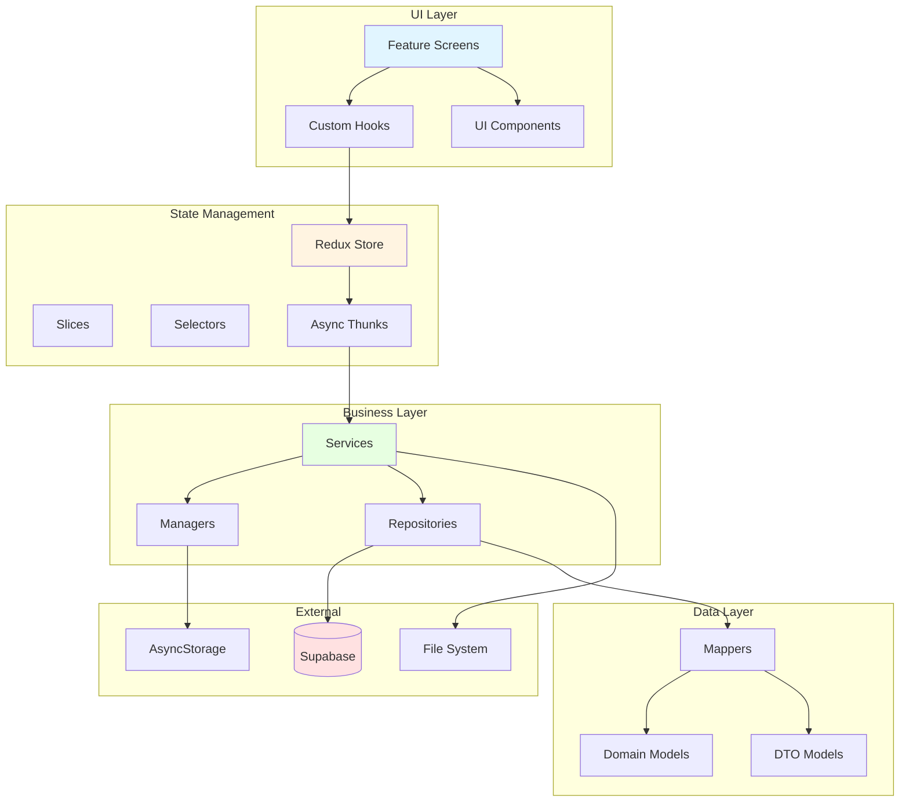
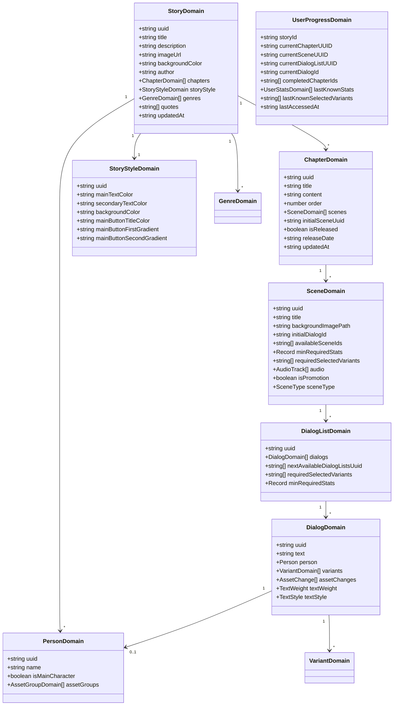
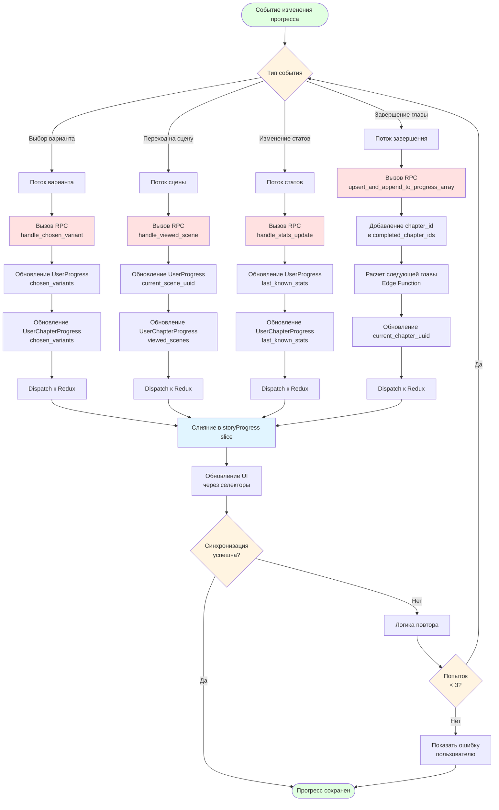
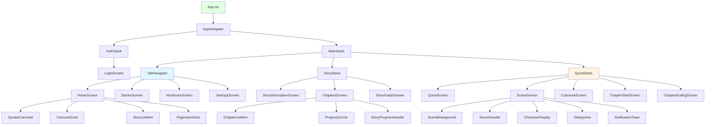
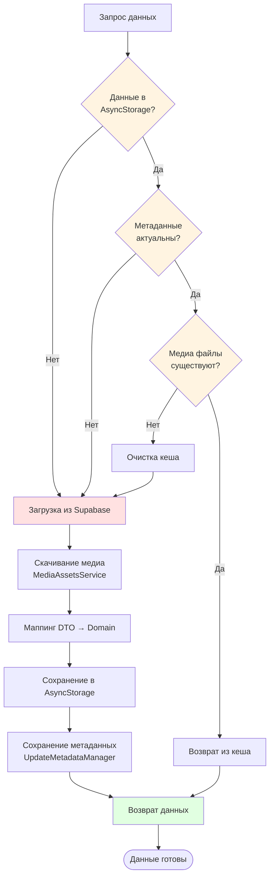

# 🏗️ Архитектура проекта - Диаграммы

## 📋 Оглавление
1. [Архитектура слоев](#архитектура-слоев)
2. [Сущности проекта](#сущности-проекта)
3. [Потоки данных](#потоки-данных)
4. [Загрузка историй (Блок-схема)](#загрузка-историй)
5. [Квест геймплей (Блок-схема)](#квест-геймплей)
6. [Управление прогрессом (Блок-схема)](#управление-прогрессом)

---

## 🏛️ Архитектура слоев



---

## 📦 Сущности проекта

### Основные Domain модели



---

## 🔄 Потоки данных

### Redux Store структура

```mermaid
graph TB
    subgraph "Root State"
        Auth[auth]
        Story[story]
        Chapter[chapter]
        Progress[storyProgress]
        Quest[quest]
        Cutscene[cutscene]
        ChapterEnd[chapterEnding]
        Loading[loading]
        Login[login]
        Nav[navigation]
        TabBar[tabBar]
        Home[home]
    end
    
    subgraph "story - Нормализованный каталог"
        StoryById[byId: Record<id, Story>]
        AllIds[allIds: string[]]
        UserIds[userStoryIds: string[]]
        CurrentId[currentStoryId: string]
    end
    
    subgraph "chapter - Управление главами"
        ChapterByStory[byStoryId: Record<storyId, Chapter[]>]
        CurrentChapter[currentChapter: Chapter]
        ChapterLoading[loadingByStoryId]
    end
    
    subgraph "storyProgress - Прогресс пользователя"
        ProgressByStory[byStoryId: Record<storyId, UserProgress>]
        ActiveStory[activeStoryId: string]
        ProgressLoading[loadingByStoryId]
    end
    
    Story --> StoryById
    Story --> AllIds
    Story --> UserIds
    Story --> CurrentId
    
    Chapter --> ChapterByStory
    Chapter --> CurrentChapter
    Chapter --> ChapterLoading
    
    Progress --> ProgressByStory
    Progress --> ActiveStory
    Progress --> ProgressLoading
    
    style Story fill:#e1f5ff
    style Chapter fill:#fff4e1
    style Progress fill:#e7ffe1
```

---

## 📖 Загрузка историй

### Блок-схема процесса загрузки

```mermaid
flowchart TD
    Start([Запуск приложения]) --> CheckAuth{Пользователь<br/>авторизован?}
    
    CheckAuth -->|Нет| Login[Экран логина]
    CheckAuth -->|Да| InitLoading[Инициализация<br/>LoadingScreen]
    
    Login --> AuthSuccess{Авторизация<br/>успешна?}
    AuthSuccess -->|Да| InitLoading
    AuthSuccess -->|Нет| Login
    
    InitLoading --> CheckUpdates[Проверка обновлений<br/>UpdateCheckService]
    
    CheckUpdates --> NeedUpdate{Нужно<br/>обновление?}
    
    NeedUpdate -->|Да| FetchFromSupabase[Загрузка из Supabase<br/>StoriesRepository]
    NeedUpdate -->|Нет| LoadFromCache[Загрузка из кеша<br/>StoriesManager]
    
    FetchFromSupabase --> MapToDTO[Маппинг DTO → Domain<br/>StoryDomainMapper]
    MapToDTO --> SaveToCache[Сохранение в AsyncStorage<br/>StoriesManager]
    SaveToCache --> LoadGenres
    
    LoadFromCache --> CheckCache{Кеш<br/>валиден?}
    CheckCache -->|Нет| FetchFromSupabase
    CheckCache -->|Да| LoadGenres[Загрузка жанров]
    
    LoadGenres --> LoadUserProgress[Загрузка прогресса<br/>UserRepository.getAllUserProgress]
    
    LoadUserProgress --> DispatchToRedux[Диспатч в Redux Store<br/>loadingStories thunk]
    
    DispatchToRedux --> UpdateStorySlice[Обновление story slice<br/>Нормализация данных]
    UpdateStorySlice --> UpdateProgressSlice[Обновление storyProgress slice<br/>Сохранение прогресса]
    
    UpdateProgressSlice --> NavigateHome[Навигация на HomeScreen]
    
    NavigateHome --> End([Отображение историй])
    
    style Start fill:#e1ffe1
    style End fill:#e1ffe1
    style CheckAuth fill:#fff4e1
    style NeedUpdate fill:#fff4e1
    style CheckCache fill:#fff4e1
    style FetchFromSupabase fill:#ffe1e1
    style DispatchToRedux fill:#e1f5ff
```



---

## 🎮 Квест геймплей

### Блок-схема игрового процесса

```mermaid
flowchart TD
    Start([Нажатие "Читать"]) --> StartRead[Вызов startReadChapter<br/>Edge Function]
    
    StartRead --> GetProgress[Получение UserProgress<br/>Текущая глава и сцена]
    
    GetProgress --> LoadChapter{Глава в кеше?}
    
    LoadChapter -->|Нет| FetchChapter[Загрузка главы<br/>QuestRepository.getChapterDetails]
    LoadChapter -->|Да| ValidateAssets{Ассеты<br/>валидны?}
    
    FetchChapter --> DownloadMedia[Скачивание медиа<br/>MediaAssetsService]
    DownloadMedia --> SaveChapter[Сохранение в кеш<br/>QuestManager.saveChapter]
    SaveChapter --> LoadPersons
    
    ValidateAssets -->|Нет| FetchChapter
    ValidateAssets -->|Да| LoadPersons{Персонажи<br/>в кеше?}
    
    LoadPersons -->|Нет| FetchPersons[Загрузка персонажей<br/>QuestRepository.getPersonsForStory]
    LoadPersons -->|Да| LoadStats
    
    FetchPersons --> DownloadAvatars[Скачивание аватаров<br/>MediaAssetsService]
    DownloadAvatars --> SavePersons[Сохранение в кеш<br/>QuestManager.savePersons]
    SavePersons --> LoadStats
    
    LoadStats --> DispatchInit[Диспатч initializeQuest]
    DispatchInit --> MapToUI[Маппинг Domain → UI<br/>domainToUIMapper]
    MapToUI --> RenderScene[Отображение SceneScreen]
    
    RenderScene --> UserAction{Действие<br/>пользователя}
    
    UserAction -->|Выбор варианта| UpdateStats[Обновление статов<br/>UserService.updatePlayerStats]
    UserAction -->|Переход к сцене| TransitionScene[Переход на сцену<br/>SceneTransitionService]
    UserAction -->|Завершение главы| EndChapter[Завершение главы<br/>endReadChapter]
    
    UpdateStats --> SaveVariant[Сохранение выбора<br/>UserService.updateChosenVariant]
    SaveVariant --> CheckSceneRequirements{Требования<br/>сцены<br/>выполнены?}
    
    CheckSceneRequirements -->|Да| TransitionScene
    CheckSceneRequirements -->|Нет| ShowError[Показать уведомление<br/>Недостаточно статов]
    ShowError --> RenderScene
    
    TransitionScene --> LoadDialog[Загрузка DialogList<br/>QuestManager.getDialogList]
    LoadDialog --> UpdateProgress[Обновление прогресса<br/>markSceneAsViewed]
    UpdateProgress --> RenderScene
    
    EndChapter --> SaveCompletion[Сохранение завершения<br/>markChapterAsCompleted]
    SaveCompletion --> ShowEnding[Отображение<br/>ChapterEndingScreen]
    
    ShowEnding --> End([Возврат к списку глав])
    
    style Start fill:#e1ffe1
    style End fill:#e1ffe1
    style LoadChapter fill:#fff4e1
    style ValidateAssets fill:#fff4e1
    style LoadPersons fill:#fff4e1
    style CheckSceneRequirements fill:#fff4e1
    style FetchChapter fill:#ffe1e1
    style DispatchInit fill:#e1f5ff
```

---

## 💾 Управление прогрессом

### Блок-схема сохранения прогресса



---

## 🔐 Архитектура Service Layer

```mermaid
graph TB
    subgraph "Stories Domain"
        StoriesService[StoriesService]
        StoriesRepo[StoriesRepository]
        StoriesManager[StoriesManager]
        UpdateCheck[UpdateCheckService]
        ChapterUpdateCheck[ChapterUpdateCheckService]
    end
    
    subgraph "Quest Domain"
        QuestService[QuestService]
        QuestRepo[QuestRepository]
        QuestManager[QuestManager]
        SceneTransition[SceneTransitionService]
        GameplayLogic[QuestGamePlayLogicManager]
    end
    
    subgraph "User Domain"
        UserService[UserService]
        UserRepo[UserRepository]
        UserManager[UserManager]
    end
    
    subgraph "Character Domain"
        CharacterState[CharacterStateService]
        CharacterAppearance[CharacterAppearanceManager]
    end
    
    subgraph "Shared Services"
        MediaAssets[MediaAssetsService]
        AudioService[AudioService]
        SettingsService[SettingsService]
        AuthService[AuthService]
    end
    
    StoriesService --> StoriesRepo
    StoriesService --> StoriesManager
    StoriesService --> UpdateCheck
    
    QuestService --> QuestRepo
    QuestService --> QuestManager
    QuestService --> SceneTransition
    
    UserService --> UserRepo
    UserService --> UserManager
    
    CharacterState --> CharacterAppearance
    
    QuestRepo --> MediaAssets
    SceneTransition --> GameplayLogic
    QuestService --> CharacterState
    
    StoriesRepo -.-> Supabase[(Supabase)]
    QuestRepo -.-> Supabase
    UserRepo -.-> Supabase
    
    StoriesManager -.-> AsyncStorage[(AsyncStorage)]
    QuestManager -.-> AsyncStorage
    UserManager -.-> AsyncStorage
    
    style StoriesService fill:#e1f5ff
    style QuestService fill:#fff4e1
    style UserService fill:#e7ffe1
    style Supabase fill:#ffe1e1
    style AsyncStorage fill:#ffe1e1
```



---

## 🎨 UI Component Hierarchy



---

## 📱 Data Flow Example: Выбор варианта диалога

```mermaid
flowchart LR
    UI[DialogView<br/>Нажатие на вариант] -->|1. handleVariantPress| Component[SceneScreen]
    
    Component -->|2. dispatch| Thunk[advanceToNextDialog]
    
    Thunk -->|3. Проверка требований| Logic[QuestGamePlayLogicManager]
    Logic -->|4. checkStatsRequirements| Validation{Статы<br/>достаточны?}
    
    Validation -->|Нет| Error[Показать NotificationToast]
    Validation -->|Да| UpdateStats[UserService.updatePlayerStatsForStory]
    
    UpdateStats -->|5. RPC call| Supabase[(Supabase<br/>handle_stats_update)]
    
    Supabase -->|6. Обновление| DB[(UserProgress &<br/>UserChapterProgress)]
    
    DB -->|7. Возврат данных| UpdateStats
    UpdateStats -->|8. Сохранение варианта| SaveVariant[UserService.updateChosenVariant]
    
    SaveVariant -->|9. RPC call| Supabase2[(Supabase<br/>handle_chosen_variant)]
    Supabase2 -->|10. Обновление| DB
    
    SaveVariant -->|11. Получение DialogList| QuestService[QuestService.getDialogListById]
    QuestService -->|12. Из кеша| Manager[QuestManager]
    
    Manager -->|13. Маппинг| Mapper[domainToUIMapper]
    Mapper -->|14. DialogList| Redux[Redux quest.slice]
    
    Redux -->|15. Обновление state| Component
    Component -->|16. Re-render| UI
    
    style UI fill:#e1f5ff
    style Validation fill:#fff4e1
    style Supabase fill:#ffe1e1
    style Supabase2 fill:#ffe1e1
    style Redux fill:#e7ffe1
```



---

## 🗄️ Кэширование и валидация




