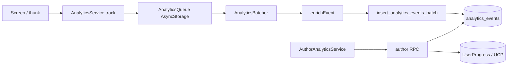

# Аналитика — техническая спецификация

Как устроена product-аналитика в RN и Supabase, и как добавлять новые события.

См. также: [Аналитика события.md](./analytics-events.md) — бизнес-каталог.

---

## Архитектура



**Два слоя:**
1. **Milestones** — `analytics_events` из RN (батчами).
2. **Агрегаты автора** — RPC в LimerenceBuilder: чтение на лету из `UserProgress` / `UserChapterProgress` + выборочно `analytics_events` (trend, platform, discovery). **Без daily rollup таблицы.**

Milestones **не** логируют каждый тап/реплику — только ключевые точки воронки.

---

## Модули RN (`src/Service/Analytics/`)

| Модуль | Роль |
|--------|------|
| `AnalyticsService` | Facade: `init`, `track`, `identify`, `reset`, `flush` |
| `AnalyticsQueue` | In-memory + AsyncStorage `@analytics/event_queue`, debounce persist |
| `AnalyticsBatcher` | Flush triggers, mutex `isFlushing`, retry backoff |
| `enrichEvent` | `QueuedEvent` → `AnalyticsEventRow` (колонки + properties) |
| `analyticsContext` | `device_id`, `session_id`, `user_id`, `env`, quest context |
| `DeviceContext` | Snapshot устройства в `properties` при flush |
| `resolveAnalyticsEnv` | `sandbox` / `prod` для **analytics_events только** |
| `analyticsHelpers` | `handleNavigationStateChange`, `trackQuestAdvanceResult` |
| `analyticsEvents` | Константы имён событий |
| `analyticsConstants` | Пороги батчинга, лимиты очереди, session timeout |

Инициализация: `App.tsx` → `analytics.init()`.

---

## Event envelope

### Top-level колонки (`analytics_events`)

| Поле | Источник | Назначение |
|------|----------|------------|
| `user_id` | `analyticsContext` | RLS, join; `null` до login |
| `device_id` | AsyncStorage persistent UUID | Анонимные сессии |
| `session_id` | In-memory, 30 min timeout | Группировка сессии |
| `event` | `analyticsEvents` constant | Имя события |
| `env` | `resolveAnalyticsEnv()` | `sandbox` \| `prod` |
| `context_scope` | `track({ contextScope })` | app / auth / discovery / quest / … |
| `story_id` | `context.storyId` если scope позволяет | Author filters |
| `chapter_id` | `context.chapterId` если `quest` | Funnel по главе |
| `client_created_at` | `queued_at` | Clock skew |
| `properties` | event-specific + device envelope | jsonb |

`env` — **только** колонка `analytics_events`, не дублируется в `properties`.

### `properties` (merge при flush)

Всегда добавляются из `DeviceContext`: `platform`, `os_version`, `app_version`, `device_model`, …  
Плюс: `is_authenticated`, `auth_provider`, и поля из `track({ properties })`.

---

## `context_scope` — технические правила (`enrichEvent`)

| scope | `story_id` | `chapter_id` | Guard |
|-------|------------|--------------|-------|
| `app`, `auth`, `onboarding`, `paywall` | `NULL` | `NULL` | — |
| `discovery` | из `context.storyId` | `NULL` | warn если нет story |
| `quest` | из `context.storyId` | из `context.chapterId` | `console.warn` если нет story/chapter |

`scene_id`, `dialog_list_id` и др. — только в `properties`, не в колонках.

---

## Batching

Константы: `src/Service/Analytics/analyticsConstants.ts`

| Триггер | Условие |
|---------|---------|
| Size | `queue.length >= 20` |
| Timer | каждые 30s если очередь не пуста |
| Background | `AppState` → background/inactive |
| Login | `analytics.identify()` |
| Logout | `analytics.reset()` |
| Startup | непустая очередь после `init()` |

- RPC лимит: **50** событий за batch (`ANALYTICS_MAX_BATCH_RPC`)
- Очередь max **500**; старые отбрасываются
- Retry: 5s → 30s → 60s → 300s
- `ANALYTICS_CONSOLE_ONLY` — только лог в dev (default `false`)

---

## Session и device

- `device_id`: UUID в AsyncStorage `@analytics/device_id`, создаётся при первом `init()`
- `session_id`: новый при cold start / timeout 30 min в background
- `generateUuid`: crypto UUID v4
- `DeviceContext`: Platform fallback (`device_model` = OS name); `is_emulator` ≈ `__DEV__`

---

## `env` (только analytics)

| Сборка | `env` |
|--------|-------|
| dev / staging | `sandbox` |
| production | `prod` |
| Override | `REACT_NATIVE_ANALYTICS_ENV=sandbox\|prod` |

Progress RPC (`UserProgress`) **не** входит в scope env для этого документа.

---

## Supabase

Миграции: `LimerenceBilder/supabase/migrations/20260612*` … `20260622*`

| Объект | Назначение |
|--------|------------|
| `analytics_events` | Raw milestones, retention 90 дней |
| `story_permissions` | Доступ авторов к метрикам |
| `insert_analytics_events_batch` | Batch insert с валидацией `env` |
| `_assert_story_author`, `_filtered_user_progress` | Helpers для author RPC |
| Author RPC (progress) | `get_story_analytics_overview`, `get_story_chapter_funnel`, `get_story_scene_dropoff`, `get_story_variant_stats` |
| Author RPC (events) | `get_story_analytics_trend`, `get_story_dialog_dropoff`, `get_story_platform_breakdown`, `get_story_session_stats`, `get_story_discovery_funnel`, `get_story_replay_stats`, `get_story_retention_cohorts`, `get_story_ending_stats` |
| Author RPC (monetization stub) | `get_story_revenue_overview`, `get_story_premium_choice_stats` |
| Cron | `cleanup_analytics_events_retention` (90d) |

**Применение на cloud:** `LimerenceBilder/supabase/manual/apply_analytics_to_cloud.sql`  
Если `CREATE OR REPLACE` падает с `42P13`: сначала `DROP FUNCTION` (см. `20260612100003_analytics_author_rpc.sql`).

RLS: пользователь пишет свои events; raw `analytics_events` недоступны авторам — только через SECURITY DEFINER RPC.

---

## Builder (LimerenceBuilder)

- `AuthorAnalyticsService` — обёртка над author RPC (`supabase.rpc()`)
- `/story/:storyId/analytics` — полноэкранный дашборд (`StoryAnalyticsPage`)
- `AnalyticsEnvFilter` — `p_env` default `'prod'`, sandbox в sessionStorage `builder_analytics_env`
- Фильтры периода/chapter/tab — URL search params (`useAnalyticsFilters`)

---

## Как расширить аналитику

1. **Константа** в `analyticsEvents.ts`
2. **`analytics.track()`** в нужном thunk/screen:
   - `contextScope` по матрице выше
   - `context: { storyId, chapterId? }` для discovery/quest
   - `properties` — event-specific (без PII)
3. **Запись** в [Аналитика события.md](./analytics-events.md): зачем, properties
4. **Author metric** (если нужна новая метрика в дашборде) — RPC/rollup в Supabase + UI в Builder
5. **Тест** — pure-логика или unit на `enrichEvent` если меняются guards

Зарезервированные scope без реализации: `onboarding`, `paywall`.

```ts
// Пример: событие вне истории
analytics.track('onboarding_step_viewed', {
  contextScope: 'onboarding',
  properties: { step_id: 'welcome', step_index: 1 },
});

// Пример: quest milestone
analytics.track(ANALYTICS_EVENTS.QUEST_SCENE_ENTERED, {
  contextScope: 'quest',
  context: { storyId, chapterId },
  properties: { scene_id: sceneUuid, scene_type: 'regular' },
});
```
