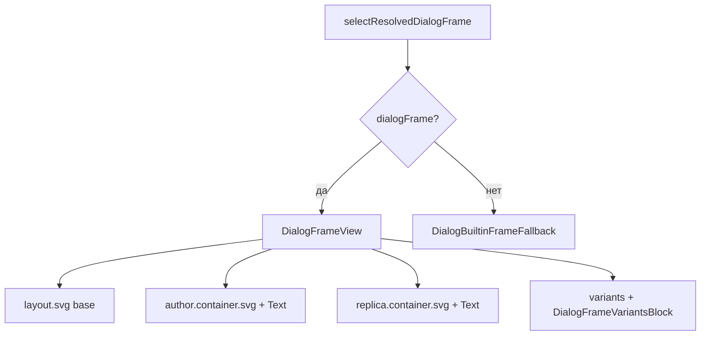

# Рамка диалога (DialogFrame)

Визуальная оболочка реплики на сцене квеста: позиция на экране, SVG-подложки и типографика для **автора**, **текста реплики** и **вариантов ответа**. Контент задаётся в **LimerenceBilder** и хранится в Supabase; в приложении только чтение и рендер.

Связанные сущности: [[Диалог]], [[Сцена]].

---

## Источник данных

| Слой | Где |
|------|-----|
| БД | Таблица `DialogFrame` (Supabase) |
| Поле layout | `layout_data` (jsonb) — **единственный** источник SVG и отступов |
| Legacy | Колонка `svg` в таблице **не используется** (миграция в Bilder: `drop_svg_column`) |

Строка реплики ссылается на рамку через `Dialog.frame_id` (UUID). `NULL` — рамка по умолчанию для истории.

---

## Модель `layout_data`

Структура совпадает с редактором (`DialogFrameBody` / `DialogFrameLayout` в LimerenceBilder).

### Верхний уровень (`DialogFrameLayoutDomain`)

| Поле | Назначение |
|------|------------|
| `svg` | Базовая подложка всей рамки (опционально) |
| `height_auto` / `heightAuto` | Высота по контенту |
| `frame_height_px` / `frameHeightPx` | Минимальная высота блока (px) |
| `screen_position_vertical` | `top` \| `center` \| `bottom` — якорь на экране |
| `screen_offset_*` | Отступы от краёв экрана (px) |
| `author` | Блок имени персонажа |
| `replica` | Блок текста реплики |
| `variants` | Блок списка вариантов |

### Области author / replica / variants

Каждая область — пара **container** + **text**:

```json
{
  "container": {
    "svg": "<svg>...</svg>",
    "margin": { "top": 0, "left": 8, "right": 8, "bottom": 0 }
  },
  "text": {
    "padding": { "top": 0, "left": 0, "right": 0, "bottom": 8 },
    "align": "left",
    "fontSize": 16,
    "fontWeight": "bold",
    "fontStyle": "normal",
    "color": "#ffffff"
  }
}
```

У **variants** дополнительно:

- `container` — фон всего списка вариантов  
- `gap` — расстояние между строками  
- `item.container.svg` — SVG одной кнопки варианта (шаблон на все строки)  
- `item.text` — стили текста варианта  

**Важно:** отсутствие `container.svg` у области **не** подменяет другую рамку — область рисуется на **прозрачном** фоне, виден только текст (с цветом из `text.color` или fallback).

---

## Слои приложения (DTO → UI)

```
Supabase DialogFrame
        ↓
DialogFrameDTO (snake_case, layout_data)
        ↓  DialogFrameMapper + mapDialogFrameLayoutFromRaw
DialogFrameDomain (camelCase)
        ↓  Redux quest.dialogFrames + кеш AsyncStorage
selectResolvedDialogFrame
        ↓
DialogView → DialogFrameView | DialogBuiltinFrameFallback
```

### DTO / Domain

- **DTO:** `src/Service/data/DTO/index.ts` — `DialogFrameDTO`  
- **Layout map:** `src/Service/data/mapDialogFrameLayout.ts` — jsonb/string → `DialogFrameLayoutDomain`  
- **Domain:** `src/Service/data/Domain/DialogFrameDomain.ts`, `DialogFrameLayoutDomain.ts`  
- **Правило:** в Store/селекторах только Domain, без сырых DTO  

### Загрузка и кеш

1. При `initializeQuest(storyId)` вызывается `fetchDialogFrames(storyId)` (`quest/thunks.ts`).  
2. `StoriesService.getDialogFrames`: сначала AsyncStorage `@story_{storyId}_dialog_frames`, иначе API.  
3. `StoriesRepository.getDialogFrames` — `from('DialogFrame').select(...).eq('story_id', storyId)`.  
4. Результат кладётся в `state.quest.dialogFrames` (`quest/slice.ts`).

---

## Выбор рамки для реплики

Функция: `src/Feature/Quest/dialogFrame/resolveDialogFrame.ts`  
Селектор: `selectResolvedDialogFrame` в `src/App/store/quest/selectors.ts`.

| Условие | Результат |
|---------|-----------|
| `quest.dialogFrames` пуст | `null` → встроенный fallback (см. ниже) |
| У реплики есть `frame_id` и рамка найдена | эта рамка |
| `frame_id` указан, но UUID не найден | **default** истории (`is_default`), иначе первая в списке |
| `frame_id` нет (`null` / undefined) | **default**, иначе первая |

Default **не** заменяется на «рамку с графикой», даже если у default пустой `layout_data`.

---

## Отрисовка на сцене

Точка входа: `SceneScreen` → `DialogView` с `dialogFrame={selectResolvedDialogFrame}`.



### `DialogFrameView`

Паритет с `DialogFrameBody` + позиционирование как `DialogViewWeb` в редакторе.

1. **Оболочка:** `dialogFrameOverlayShellStyle` — flex на всю зону сцены.  
2. **Fill:** `getDialogFrameOverlayFillStyle(vertical)` — absolute, padding, `justifyContent` по вертикали.  
3. **Коробка:** `getDialogFrameBoxStyle(layout)` — margins, `minHeight` (80px только если в layout есть реальная конфигурация, не для пустого `{}`).  
4. **Слои SVG** (снизу вверх по z-index):  
   - корневой `layout.svg`  
   - author: `DialogFrameSvgLayer` + `Text` (имя из `replica.person`)  
   - replica: `DialogFrameSvgLayer` + `Text` (текст реплики)  
   - variants: `DialogFrameVariantsBlock`  

Секции author/replica: `position: relative`, SVG — `absoluteFill` под текстом.

### `DialogFrameSvgLayer`

- Файл: `src/Feature/Quest/components/dialogFrame/DialogFrameSvgLayer.tsx`  
- `prepareInlineDialogFrameSvg(svg, idSuffix)` перед `SvgXml`:  
  - `preserveAspectRatio="none"` (растягивание как в редакторе)  
  - суффиксы для `id`, `url(#id)`, `href="#id"` — чтобы несколько SVG на экране не конфликтовали  
- **Дополнительных цветов/opacity в RN на контейнер SVG не накладывается.**

### Цвета текста

`src/Feature/Quest/dialogFrame/frameTextColor.ts`:

- Из layout: `text.color` только если валидный `#RRGGBB` (6 hex).  
- Иначе fallback: author `rgba(255,255,255,0.9)`, replica/variant `#fff`.  
- Вес/курсив вариантов: `dialogFrameTypography.ts`; реплика также учитывает `replica.textWeight` / `textStyle` из модели диалога.

### `DialogBuiltinFrameFallback`

Когда у истории **нет ни одной** записи `DialogFrame` в Redux (`dialogFrames.length === 0`).

- Одна подложка `rgba(0,0,0,0.7)`, скругление 12.  
- Имя и текст — белым, варианты — светлые кнопки (legacy UI).  
- Не использует `layout_data`.  
- Файл: `src/Feature/Quest/components/DialogBuiltinFrameFallback.tsx`

---

## Поведение пустого SVG

| Ситуация | Поведение |
|----------|-----------|
| Пустой `layout_data` у default-рамки | Рамка всё равно выбрана; только текст на прозрачном фоне |
| Нет `author.container.svg` | Только текст автора, без подложки |
| Нет `replica.container.svg` | Только текст реплики |
| Нет корневого `layout.svg` | Нет базовой подложки, остальные области как настроены |

Чёрный полупрозрачный фон **не** добавляется автоматически для пустых рамок из БД — только `DialogBuiltinFrameFallback`.

---

## Анимации переходов

**Orchestrated flow (SceneScreen):** `QuestReplicaTransitionProvider` — две фазы:

1. **transitionOut** (параллельно): pan камеры + fade out персонажа + fade out реплики
2. **transitionIn** (параллельно): fade in нового персонажа (если виден) + новой реплики

Блокировка «Далее» и вариантов на всю последовательность (`isInteractionLocked`).

**Scene-level flow (смена `scene.uuid`):** см. [[Сцена]] — fade-to-black → reveal фона (snap camera) → **только transitionIn** (параллельно character + dialog, без transitionOut). Координирует `QuestSceneTransitionProvider`; replica-provider запускает entryIn после `backgroundRevealedToken`.

**Autonomous flow (Wardrobe / без provider):** классификация `dialogFrameTransition.ts` → `classifyDialogFrameTransition`.

| `TransitionKind` | Условие | Поведение |
|------------------|---------|-----------|
| `initial` | первый показ | без fade |
| `frame_swap` | сменился `frame.uuid` | opacity всей коробки 0 → 1, смена layout/SVG |
| `replica_content` | другая реплика | fade контента (autonomous) |
| `variants_change` | появились/пропали варианты | `FadeIn`/`FadeOut` блока и строк |

Длительности: `dialogFrameAnimationConstants.ts`, `sceneBackground/constants.ts`.

---

## Ограничения React Native

SVG рендерится через `react-native-svg` (`SvgXml`). Не все SVG Filter Effects из браузера поддерживаются одинаково (например `feTurbulence`, сложные `feBlend`). Визуал может отличаться от превью в редакторе при тёмном фоне сцены и через края mask.

Рекомендация для авторов рамок: по возможности избегать тяжёлых фильтров в mobile или упрощать SVG.

---

## Карта файлов (квест)

| Назначение | Путь |
|------------|------|
| Резолв рамки | `src/Feature/Quest/dialogFrame/resolveDialogFrame.ts` |
| Author layout | `.../resolveDialogFrameAuthor.ts` |
| Replica layout | `.../resolveDialogFrameReplica.ts` |
| Variants layout | `.../resolveDialogFrameVariants.ts` |
| Позиционирование | `.../getDialogFrameContainerStyle.ts` |
| Подготовка SVG | `.../prepareInlineDialogFrameSvg.ts` |
| UI рамки | `src/Feature/Quest/components/DialogFrameView.tsx` |
| SVG слой | `.../dialogFrame/DialogFrameSvgLayer.tsx` |
| Варианты | `.../DialogFrameVariantsBlock.tsx` |
| Оболочка | `.../DialogView.tsx` |
| Fallback без БД | `.../DialogBuiltinFrameFallback.tsx` |
| Селектор | `src/App/store/quest/selectors.ts` → `selectResolvedDialogFrame` |
| Тесты резолва / classify | `src/Feature/Quest/utils/__tests__/questSceneUtils.test.ts` |
| Классификация переходов | `.../dialogFrame/dialogFrameTransition.ts` |
| Хук анимаций | `.../dialogFrame/useDialogFrameContentTransition.ts` |
| Snap реплики | `.../context/QuestReplicaTransitionContext.tsx` |

Утилита `hasRenderableDialogFrameLayout` — проверка «есть ли что рисовать» (паритет с редактором); **не** влияет на выбор рамки в рантайме.

---

## Связь с репликой

В [[Диалог]]:

- `frame_id` — опциональный UUID рамки; см. таблицу резолва выше.  
- Остальное (камера, позиция персонажа) независимо от рамки: `selectEffectiveCameraX`, `selectCharacterSceneLayout`.

---

## Чеклист при изменениях

1. Меняется jsonb в Bilder → обновить `DialogFrameLayoutDomain` / `mapDialogFrameLayoutFromRaw` при новых полях.  
2. Меняется логика выбора → `resolveDialogFrame` + тесты в `questSceneUtils.test.ts`.  
3. Меняется вёрстка → сверка с `DialogFrameBody` / `DialogViewWeb` в LimerenceBilder.  
4. После смены схемы кеша — bump ключа в `StoriesManager` (`@story_{id}_dialog_frames`).
