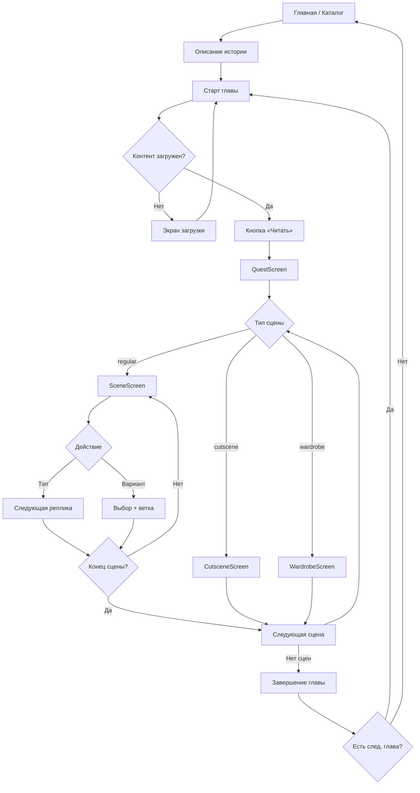
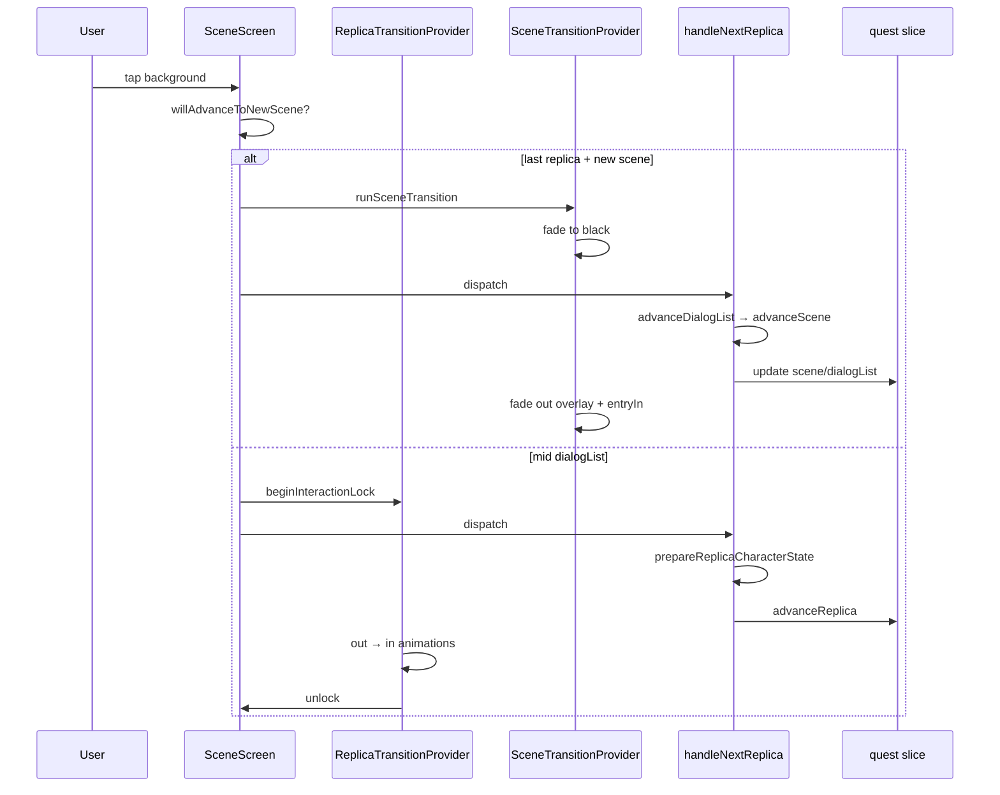

# Полное описание геймплея Limerence

Документ описывает **бизнес-логику и пользовательский опыт** (часть I) и **техническую реализацию** (часть II) отдельно.

Источник истины для правил: `docs/specs/gameplay/`. Код — `src/Feature/Quest/`, `src/App/store/quest/`, `src/Service/Quest/`.

---

# ЧАСТЬ I. БИЗНЕС-ЛОГИКА И ПОЛЬЗОВАТЕЛЬСКИЙ ОПЫТ

## 1. Иерархия контента

```
Книга (Story)
 └── Глава (Chapter) × N
      └── Сцена (Scene) — граф, не линейный список
           └── DialogList — ветка диалогов
                └── Диалог / Реплика (Dialog) × N
                     └── Исход (Variant) × 0..N
```

| Сущность | Роль для игрока |
|----------|-----------------|
| **Книга** | История с обложкой, описанием, автором, списком глав и прогрессом |
| **Глава** | Эпизод с названием, обложкой, набором сцен; имеет статус `locked` / `available` / `read` |
| **Сцена** | Экран с фоном, музыкой и игровым режимом (`regular`, `cutscene`, `wardrobe`) |
| **DialogList** | Линейная цепочка реплик внутри сцены `regular`; ветвление через `nextAvailableDialogList` |
| **Диалог (реплика)** | Текст, персонаж, рамка, камера, варианты выбора, смена одежды |
| **Исход** | Кнопка выбора; меняет статы и открывает/закрывает ветки |
| **Статы** | Числовые характеристики игрока (храбрость, сила и т.д.), накапливаются по главе |
| **Персонаж** | Спрайт из слоёв (тело, одежда); один говорящий на экране |
| **Рамка диалога** | SVG-оболочка текста, имени и кнопок вариантов |

---

## 2. Полный жизненный цикл игрока



---

## 3. Сценарии по этапам

### 3.1. Каталог и выбор истории

**Экраны:** `HomeScreen`, `StoriesScreen`, `MyStoriesScreen`.

**Что видит пользователь:**
- Карусель и/или список книг: обложка, название, автор, жанры.
- Цвета интерфейса (таббар, текст) подстраиваются под `storyStyle` активной истории.

**Действия:**
- Тап по книге → `StoryDescriptionScreen`.

**Бизнес-логика:**
- Прогресс по каждой истории хранится отдельно (`storyProgress.byStoryId[storyId]`).
- При старте приложения загружаются все прогрессы пользователя (`loadAllUserProgress`).

---

### 3.2. Описание истории (`StoryDescriptionScreen`)

**Что видит пользователь:**
- Обложка, название, автор, жанры, описание (с «развернуть» при длинном тексте).
- Шапка прогресса (`StoryProgressHeader`): сколько глав пройдено.
- Кнопка **«Читать»** — активна, если есть доступная глава.
- Ссылки: **Оглавление глав**, **Граф сюжета** (если реализован).

**Действия:**
- **Читать** → `ChapterStartScreen` с `storyId`.
- Кнопка «Назад» → каталог.

**Бизнес-логика:**
- Кнопка «Читать» ведёт на **текущую** главу из `userProgress.currentChapterUUID`.
- Если все главы прочитаны — кнопка неактивна / предупреждение в консоли.

---

### 3.3. Старт главы (`ChapterStartScreen`)

**Что видит пользователь (фазы):**

| Фаза | UI |
|------|-----|
| Загрузка истории | Spinner + «Загрузка истории...» |
| Проверка обновлений | `LoadingScreen` с цитатами, прогресс-бар, overlay «Загрузка контента» |
| Готово к чтению | Размытая обложка истории, «Глава № N», название главы, кнопка **«Читать»**, «Назад» |
| Ошибка | Сообщение об ошибке, «Повторить», «Назад» |

**Действия:**
- **Читать** → при необходимости догружает ассеты главы → `QuestScreen`.
- **Назад** / отмена загрузки → возврат.

**Бизнес-логика:**
- Определяется `currentChapterUUID` из прогресса пользователя.
- `initChapterStart` вызывает `StoriesService.checkChapterContentUpdateNeeded(storyId, chapterId)`:
  - **Кеш свежий** (валидный QuestManager-кеш **и** `Chapter.updated_at` ≤ `cached.updatedAt`) → `updateNeeded=false`, экран «Глава № N».
  - **Нет кеша или устарел** (правка в админке) → `updateNeeded=true`, фаза estimate/download.
  - **Ошибка проверки / сеть**, но локальный кеш валиден → `updateNeeded=false`, чтение не блокируется.
- Скачивание: `startChapterDownload` → `QuestService.getChapterDetails(forceUpdate=true)` — всегда re-fetch, не stale cache.
- `ChaptersScreen` при выборе главы вызывает ту же проверку (`checkChapterUpdateNeeded`) — кнопка «Загрузить» при `updateNeeded=true`.
- При переходе с `ChapterEndingScreen` передаётся `previousChapterId` — thunk ищет **следующую** главу; если её нет — возврат к списку глав.

> **TODO (целевое поведение):** экран «Глава № N» + **«Читать»** показываются только когда глава полностью готова к игре (см. TODO в §3.4). До этого — единый прогресс загрузки на `ChapterStartScreen`, без повторного loader на `QuestScreen`.

---

### 3.4. Инициализация квеста (`QuestScreen` → первая сцена)

**Что видит пользователь:**
- Полноэкранный loader (цвет фона из `storyStyle`) пока `quest.status === 'loading'`.
- Затем — один из экранов сцены без навигационного «прыжка» между типами.

> **TODO:** убрать loader на `QuestScreen`. К моменту нажатия **«Читать»** на `ChapterStartScreen` должны быть уже загружены и готовы к показу **все** данные, которые сейчас подтягивает `initializeQuest`: глава (scenes), персонажи + appearance, dialog frames, для **`regular`** — текущий DialogList и реплика (по checkpoint/progress), prefetch слоёв/asset_changes, project assets для аудио. `ChapterStartScreen` / `loadCurrentChapterForStory` должны гарантировать это **до** `navigation.replace(QUEST)`; `initializeQuest` — только восстановить Redux из уже готового кеша (без второго экрана загрузки).

**Бизнес-логика восстановления позиции:**
1. Загружается прогресс: `userProgress` + локальный **checkpoint** (`ReadingCheckpointManager`) — checkpoint имеет приоритет для `currentSceneUUID`, `currentDialogListUUID`, `currentDialogId`.
2. Загружаются: глава, персонажи, рамки диалогов, внешность персонажей.
3. Находится сцена по `currentSceneUUID` (или `chapter.initialSceneUuid`).
4. Загрузка диалогов зависит от `sceneType`:
   - **`regular`** — DialogList и `replicaIndex` (resume по checkpoint/progress).
   - **`cutscene`** / **`wardrobe`** — DialogList и индекс реплики **отсутствуют**; прогресс позиции — только `currentSceneUUID`.
5. BGM сцены (`playSceneBgm`) — для всех типов.
6. Подготовка снимка персонажа и аудио реплики (`prepareReplicaCharacterState`, `runReplicaAudioEvents`) — **только для `regular`**, когда есть текущая реплика.

**Вход в первую сцену (запуск истории / «Читать»):**
- После `initializeQuest` первая сцена открывается **с чёрным overlay** — тот же orchestrated flow, что при смене сцен (§3.8).
- Для игрока: экран темнеет (или остаётся чёрным после loader) → под overlay готовится контент → overlay fade out → для `regular` fade in персонажа и рамки.
- Фаза **exit** при первом входе не обязательна (нет предыдущей сцены); достаточно **reveal** + **entryIn**. Overlay при этом **обязателен** — мгновенный snap первой сцены без затемнения **не** используется.

---

### 3.5. Обычная сцена (`SceneScreen`, `sceneType: regular`)

**Контракт входа:** `SceneScreen` **не** показывает loader и **не** показывает экран завершения главы. Preflight контента — `ChapterStartScreen`; `initializeQuest` — loader на `QuestScreen`. Завершение главы → `QuestScreen` navigates → `ChapterEndingScreen`.

**Invariant:** монтируется только при `scene` + `currentReplica` + `playing`. Нарушение → `null` (bug).

**Что видит пользователь:**

| Слой | Содержимое |
|------|------------|
| Фон | `backgroundURLString`, горизонтальный pan по `camera_position_x` (0–1) |
| Персонаж | Composited спрайт 500×800, позиция left/center/right, fade in/out |
| Рамка диалога | SVG-подложки, имя (не для ГГ), текст реплики |
| Варианты | Кнопки внутри рамки (если есть) |
| Шапка | Домой, Гардероб, Оглавление |
| Toast | Уведомление при выборе (если `variant.notification`) |

**Взаимодействие:**

| Действие | Условие | Результат |
|----------|---------|-----------|
| Тап по фону | Нет вариантов, нет блокировки ввода | Следующая реплика |
| Тап по варианту | Нет блокировки | Выбор → смена ветки |
| Повторный тап | Идёт анимация / prepare | **Игнорируется** |

**Бизнес-логика одной реплики:**
1. Показывается текущая реплика (`replicaIndex` в `dialogList`).
2. При тапе «Далее»:
   - Если не последняя реплика → подготовить **следующую** реплику (снимок персонажа, asset_changes) → `replicaIndex += 1` → анимация out/in.
   - Если последняя реплика → `advanceDialogList` (следующая ветка или сцена).

**Персонаж на реплике:**
- С `person`: спрайт виден, имя в рамке (кроме главного героя).
- Без `person` (рассказчик): спрайт скрывается.
- `asset_changes`: permanent смена слоёв гардероба (сохраняется между сессиями).

**Камера:**
- `camera_position_x` на реплике; если NULL — наследуется от предыдущих в DialogList, иначе 0.5.
- При смене реплики — pan камеры (если значение изменилось).

**Аудио:**
- BGM сцены: `scene.audioTracks[0]`, loop, замена при смене сцены.
- На реплике: `audioEvents` — stop_all, play_overlay, stop_other_play (см. спецификацию АудиоТрек).

---

### 3.6. Выбор варианта (Исход)

**Что видит пользователь:**
- Вместо тапа «Далее» — список кнопок с текстом варианта.
- Опционально: иконка стата, «+1», toast с пояснением.

**Бизнес-логика после выбора:**
1. UUID варианта добавляется в `lastKnownSelectedVariants` (если ещё не был).
2. Применяются `statsChanges` к локальным статам → **немедленное** сохранение.
3. Вариант пишется на сервер (`updateChosenVariant`).
4. Сразу вызывается `advanceDialogList` — **не** переход к следующей реплике в том же списке, а выбор **следующего DialogList** из `nextAvailableDialogList` по условиям.

**Влияние на сюжет:**
- `minimumRequiredStats` / `requiredSelectedVariants` на DialogList и Scene определяют доступность веток.
- Первый подходящий элемент из списка кандидатов выбирается (порядок в массиве = приоритет).

---

### 3.7. Смена DialogList внутри сцены

**Что видит пользователь:**
- Та же сцена и фон.
- Может смениться персонаж, текст, варианты.
- Анимация **replica-level** (fade out/in рамки и персонажа), **без** чёрного overlay сцены.

**Бизнес-логика:**
- Текущий DialogList завершён (последняя реплика или выбор варианта).
- Из `nextAvailableDialogList` загружаются кандидаты, фильтруются по статам и вариантам.
- Если ни один не подходит → переход к следующей **сцене**.
- `replicaIndex` сбрасывается в 0.

---

### 3.8. Переход между сценами

**Что видит пользователь:**
1. Экран темнеет (fade to black, ~300 ms).
2. Под overlay меняется контент (фон, музыка, персонаж, диалог).
3. Overlay исчезает — новый фон виден сразу (камера snap, без pan).
4. Для `regular`: fade in персонажа и рамки (~140 ms).
5. Ввод заблокирован на всю цепочку.

**Когда применяется:** только при смене `scene.uuid` (включая первый вход в главу после «Читать», см. §3.4). Overlay **всегда** участвует, без исключений по длительности.

**Не путать с §3.7:** смена DialogList **внутри той же сцены** — это не переход между сценами; там replica-level fade (рамка/персонаж), чёрный overlay **не** используется.

**Бизнес-логика выбора следующей сцены:**
- Из `currentScene.availableSceneIds` по порядку ищется первая сцена, где:
  - все `minimumRequiredStats` выполнены;
  - все `requiredSelectedVariants` были выбраны ранее.
- Если кандидатов нет → **глава завершена**.

---

### 3.9. Катсцена (`CutsceneScreen`, `sceneType: cutscene`)

**Что видит пользователь:**
- Только фон сцены + шапка (Домой, Гардероб, Оглавление).
- Нет текста, персонажа, рамки.

**Действия:**
- Тап → переход к следующей сцене (с анимацией fade-to-black).

**Бизнес-логика:**
- Сцена **без DialogList** — только фон и переход по графу.
- Тот же граф сцен, что и у regular.
- При переходе cutscene → regular: prefetch asset_changes, подготовка первой реплики, аудио — как при обычном входе в сцену.

---

### 3.10. Гардероб (`WardrobeScreen`, `sceneType: wardrobe`)

**Два режима:**

| Режим | Как попасть | После «Продолжить» |
|-------|-------------|-------------------|
| **Сцена-гардероб** | Часть сюжета (`QuestScreen`) | Переход к следующей сцене (с overlay) |
| **Свободный гардероб** | Кнопка в `SceneHeader` | `navigation.goBack()` |

**Что видит пользователь:**
- Фон текущей сцены.
- ГГ слева (80% высоты экрана), preview слоёв в реальном времени.
- Правая панель: группы одежды → список слоёв → галочка на выбранном.
- Кнопка **«Продолжить»**.

**Бизнес-логика:**
- Сцена **без DialogList и без реплик** — только выбор внешности и переход дальше.
- Выборы **permanent** — сохраняются в CharacterService / Supabase.
- `availableAssets` сцены ограничивает доступные группы (для сцены-гардероба).
- В сюжетном режиме `completeWardrobeSession` → advance scene.
- При переходе wardrobe → regular: как cutscene → regular (первая реплика новой сцены).

---

### 3.11. Завершение главы (`ChapterEndingScreen`)

**Что видит пользователь:**
- Размытая обложка истории.
- «Глава завершена».
- Список итоговых статов (иконка, название, значение) или «нет характеристик».
- **Следующая глава** + **Главная** — если есть следующая глава.
- Только **Главная** — если глава последняя.

**Бизнес-логика:**
- `completeChapter` → сервер: глава в `completedChapterIds`, следующая становится `available`.
- Статы **только читаются** для отображения (не перезаписываются на этом экране).
- «Следующая глава» → `ChapterStartScreen` с `previousChapterId`.

**Триггер перехода:**
- `quest.status === 'finished'` (нет следующей сцены) → `QuestScreen` делает `navigation.replace(CHAPTER_ENDING)`.

---

### 3.12. Выход из квеста

**Шапка сцены → Домой:**
- Cleanup Redux (`cleanupStoryState`), сброс навигации на `MainTabs`.
- Аудио: `AudioService.stopAll()` при `resetQuest`.

**Шапка → Оглавление:**
- Cleanup + переход на `StoryDescriptionScreen`.

---

## 4. Нелинейность и условия ветвления

### 4.1. Проверка условий (единая логика)

Для **Scene** и **DialogList**:

```
minimumRequiredStats: { statUUID: minValue, ... }
  → у игрока stat.value >= minValue для каждого ключа

requiredSelectedVariants: [variantUUID, ...]
  → каждый UUID ∈ completedVariantIds игрока
```

Первый элемент в списке кандидатов (`availableSceneIds` / `nextAvailableDialogList`), прошедший проверку, **выбирается**.

### 4.2. Граф сцены

Сцены главы — **направленный граф**, не последовательный массив:
- У каждой сцены `availableSceneIds` — UUID следующих узлов.
- Разные ветки сюжета = разные наборы сцен, открываемые выборами и статами.

### 4.3. Граф диалогов

Внутри одной сцены:
- Несколько DialogList связаны через `nextAvailableDialogList`.
- Выбор варианта часто переключает DialogList (ветка A / ветка B).

---

## 5. Персистентность с точки зрения игрока

| Событие | Что сохраняется | Когда |
|---------|-----------------|-------|
| Выбор варианта | UUID варианта, статы | Сразу |
| Следующая реплика | `currentDialogId` | После advance (+ checkpoint в AsyncStorage) |
| Смена DialogList | `currentDialogListUUID`, первая реплика | При advanceDialogList |
| Смена сцены | `currentSceneUUID`; для **`regular`** — также dialogList и реплика | При advanceScene |
| Смена одежды | Wardrobe state per person | При сохранении гардероба / asset_changes |
| Завершение главы | completedChapterIds, unlock next | ChapterEndingScreen mount |
| Kill приложения | Checkpoint переживает kill до sync с Supabase | Каждый тап / смена сцены |

---

## 6. Аудио (поведение для игрока)

| Источник | Поведение |
|----------|-----------|
| BGM сцены | Одна loop-дорожка; смена при новой сцене; без BGM — затухает только BGM-канал |
| Реплика `stop_all` | Вся музыка и SFX останавливаются |
| Реплика `stop_other_play` | Stop all → новый трек (BGM или one-shot) |
| Реплика `play_overlay` | SFX поверх текущего BGM |
| Выход из истории | Полная остановка звука |

---

## 7. Рамка диалога (UX)

- Рамка задаётся `frame_id` на реплике; NULL → default истории.
- Позиция на экране: top / center / bottom + отступы.
- Области: **author** (имя), **replica** (текст), **variants** (кнопки).
- Нет SVG у области → прозрачный фон, только текст.
- Fallback без рамок в истории → `DialogBuiltinFrameFallback`.

**Анимация смены реплики:**
- Fade out текста/рамки/персонажа → snap контента → fade in.
- Блокировка ввода на время out + in.

---

# ЧАСТЬ II. ТЕХНИЧЕСКАЯ РЕАЛИЗАЦИЯ

## 1. Архитектура слоёв

```
UI (Feature/Quest/screens, components)
    ↓ dispatch
Redux Thunks (App/store/quest, cutscene, storyProgress, …)
    ↓
Services (QuestService, UserService, StoriesService, AudioService)
    ↓                    ↓
Managers (QuestManager, UserManager, CharacterStorageManager)
    ↓
Repository (QuestRepository, UserRepository) → Supabase / Edge Functions
```

**Правило:** UI не импортирует DTO. Thunks → Service → Domain → `domainToUIMapper` → Common models.

---

## 2. Навигация

| Route | Компонент | Роль |
|-------|-----------|------|
| `CHAPTER_START` | `ChapterStartScreen` | Преамбула главы, загрузка контента |
| `QUEST` | `QuestScreen` | Контейнер: Scene / Cutscene / Wardrobe по `scene.sceneType` |
| `CHAPTER_ENDING` | `ChapterEndingScreen` | Финал главы |
| `WARDROBE` | `WardrobeScreen` | Свободный гардероб (modal stack) |
| `STORY_DESCRIPTION` | `StoryDescriptionScreen` | Карточка истории |

**QuestScreen** не делает `navigation.replace` между Scene/Cutscene/Wardrobe — меняет **дочерний компонент** по Redux, избегая race conditions.

---

## 3. Redux: ключевые slice

### 3.1. `quest` (`App/store/quest/`)

| Поле | Назначение |
|------|------------|
| `status` | `idle` \| `loading` \| `playing` \| `finished` \| `error` |
| `storyId`, `chapter`, `scene` | Контекст текущей главы |
| `dialogList`, `replicaIndex` | Текущая ветка и позиция (**только `regular`**; для `cutscene` / `wardrobe` — `null` / `0`) |
| `effectiveCameraXByIndex` | Камера per реплика (O(1) lookup) |
| `persons`, `characterLayers` | Каталог персонажей и кэш слоёв |
| `preparedReplicaCharacter` | Снимок `{ personUUID, layers, position }` per replica UUID |
| `visiblePersonId` | Кто показан на экране (intent оркестратора) |
| `dialogFrames`, `projectAssets` | Рамки и URL аудио-ассетов |

**Жизненный цикл:** `initializeQuest` → `playing` → `finished` → navigate ChapterEnding.  
`playing` без `dialogList` — норма для `cutscene` и `wardrobe`.

### 3.2. `storyProgress` (`App/store/storyProgress/`)

Per `storyId`:
- `currentChapterUUID`, `currentSceneUUID`, `currentDialogListUUID`, `currentDialogId`
- `lastKnownStats`, `lastKnownSelectedVariants`
- `completedChapterIds`

Thunks: `loadAllUserProgress`, `startStoryReading`, `completeChapter`, `updateProgressWithVariant`, `updatePlayerStats`, `updateLocalProgress` (optimistic).

### 3.3. Прочие

- `cutscene` — status transitioning для CutsceneScreen.
- `wardrobe` — группы, preview layers, temp selections.
- `chapterEnding` — загрузка статов для UI.
- `contentUpdate` — фазы проверки/скачивания контента главы.

---

## 4. Основные thunks и цепочки

### 4.1. `initializeQuest`

```
userProgress + readingCheckpoint
→ QuestService.getChapterDetails, getPersonsForStory
→ fetchDialogFrames
→ characterService.initForChapter + setCharacterLayers
→ find scene
→ if sceneType === regular: resolve dialogList + replicaIndex; prepareReplicaCharacterState
→ if cutscene | wardrobe: dialogList = null, replicaIndex = 0
→ playSceneBgm
→ quest slice fulfilled
```

> **TODO:** перенести тяжёлую часть цепочки (getChapterDetails, getPersonsForStory, fetchDialogFrames, initForChapter, getDialogListById, prefetch) в preflight на `ChapterStartScreen` (`loadCurrentChapterForStory` или отдельный `prepareChapterForQuest`). `initializeQuest` на `QuestScreen` — синхронный hydrate Redux из кеша + `prepareReplicaCharacterState` / BGM; `quest.status` не должен уходить в `loading` при обычном старте главы.

### 4.2. `advanceQuest` (единый orchestrator)

**Triggers:** `tap` (SceneScreen) | `afterVariant` (после выбора варианта).

```
planQuestAdvance(trigger) → kind:
  tap + mid replica     → replica
  tap|afterVariant + last/no branch → dialogList (findNextDialogList)
  no next list          → scene (sceneTransitionService)
  no next scene         → finished

executeAdvancePlan:
  → enterReplicaSession (prefetch, prepareReplicaCharacterState, audio, optional BGM)
  → persistReadingPosition → ReadingProgressService.save(kind)
→ один advanceQuest.fulfilled → quest + questCharacter slice
```

**`ReadingPositionChange.kind` → персист:**

| kind | Когда | Checkpoint | Supabase |
|------|-------|------------|----------|
| `replica` | следующая реплика | `saveReplicaIfGeneration` | `updateCurrentDialog` |
| `dialogList` | смена ветки | invalidate + save | `updateCurrentDialogList` |
| `scene` | смена сцены | invalidate + save | — |
| `full` | dev navigate | atomic save | list + dialog + viewedScene |
| `correction` | resume init | save | — |

### 4.3. `handleSelectVariant`

```
updateLocalProgress (variants + stats optimistic)
→ analytics
→ advanceQuest({ trigger: 'afterVariant' })
→ persist variant/stats (background, progressSyncQueue on failure)
```

### 4.4–4.5. (удалено)

Логика бывших `advanceDialogList` / `advanceScene` / `handleNextReplica` — внутри `planQuestAdvance` + `executeAdvancePlan` (см. §4.2).

### 4.6. `handleCutsceneNext`

Тот же `SceneTransitionService`, результат:
- `navigate_to_scene` → quest slice update
- `navigate_to_ending` → CutsceneScreen → ChapterEnding

---

## 5. Игровая логика (pure)

| Модуль | Функции |
|--------|---------|
| `App/store/quest/helpers.ts` | `checkSceneConditions`, `checkDialogListConditions`, `findAvailableScene`, `findAvailableDialogList` |
| `QuestGamePlayLogicManager.ts` | Обёртки + загрузка DialogList из QuestService |
| `SceneTransitionService.ts` | `canAccessScene`, `getNextAvailableScene`, `transitionToNextScene` |
| `willAdvanceToNewScene.ts` | Предсказание: последняя реплика → уйдём на другую сцену? |

---

## 6. Персонажи и гардероб

```
characterServiceManager.getService(storyId)
  → CharacterManager per personUUID
  → getRenderLayers(), changeWardrobeAsset(assetChanges)
  → syncCharacter → Supabase appearance
```

**`prepareReplicaCharacterState`** (вызывается **до** `advanceReplica`):
1. Нет person → empty snapshot, narrator.
2. Apply `asset_changes` → layers.
3. `setCharacterLayers` + `setPreparedReplicaCharacter[replicaUuid]`.

**UI читает:** `selectDisplayedCharacter` → `preparedReplicaCharacter[currentReplica.uuid]`.

**Prefetch:** `prefetchChapterCharacterAssets`, `prefetchSceneDialogAssets` — fire-and-forget.

---

## 7. Оркестраторы анимаций

### 7.1. Scene level — `QuestSceneTransitionProvider`

Монтируется на `QuestScreen`, переживает remount дочерних экранов.

```
runSceneTransition(thunk):
  exit: overlay opacity 0→1 (300ms)
  await thunk()  // Redux swap
  reveal: overlay 1→0, sceneEntryMode=true
  entryIn (regular only): replica provider fade in character + dialog
  finishTransition → unlock input

runInitialSceneReveal() — после initializeQuest.fulfilled (первый вход в главу):
  overlay уже чёрный (или fade in с 0→1, если loader убран)
  reveal + entryIn — без exit и без thunk swap (контент уже в Redux)
```

> **TODO (код):** после `initializeQuest.fulfilled` на `QuestScreen` вызывать reveal/entryIn через scene-provider; сейчас первая сцена показывается без overlay.

Файлы: `QuestSceneTransitionContext.tsx`, `questSceneTransitionOrchestrator.ts`, `SceneTransitionOverlay.tsx`.

### 7.2. Replica level — `QuestReplicaTransitionProvider`

Монтируется на `SceneScreen`.

```
replicaIndex change (not first mount):
  transitionOut: camera pan + fade out character + dialog (parallel)
  transitionIn: fade in new character + dialog
  isInteractionLocked until complete
```

Файлы: `QuestReplicaTransitionContext.tsx`, `questReplicaTransitionOrchestrator.ts`.

**Хуки-потребители:** `useSceneCameraPan`, `useCharacterSceneTransition`, `useDialogFrameContentTransition`.

---

## 8. UI-компоненты сцены

| Компонент | Данные |
|-----------|--------|
| `SceneBackground` | URL, cameraX, onPress, crossfade внутри сцены |
| `CharacterDisplay` | layers, position, layoutMode scene/wardrobe, fade |
| `DialogView` | replica, dialogFrame, variants |
| `DialogFrameView` | SVG layers, typography из layout_data |
| `SceneHeader` | onGoHome, onGoToToc, wardrobe navigate |

**Селекторы:** `selectCurrentReplica`, `selectResolvedDialogFrame`, `selectEffectiveCameraX`, `selectCharacterSceneLayout`, `selectDisplayedCharacter`, `selectVisiblePersonId`.

---

## 9. Персистентность и отказоустойчивость

### 9.1. ReadingCheckpointManager

- AsyncStorage key: `reading_checkpoint_${storyId}`.
- Сохраняет scene / dialogList / dialogId синхронно при каждом шаге.
- `mergeIntoProgress` при init — checkpoint побеждает устаревший Supabase для позиции чтения.
- `writeGeneration` + `saveReplicaIfGeneration` — отмена stale writes после быстрой смены ветки.

### 9.2. ReadingProgressService

- **Единый facade** персиста позиции чтения (`src/Service/User/ReadingProgressService.ts`).
- Callers передают семантику события (`kind`), не выбор канала.
- Делегирует в `ReadingCheckpointManager` (локально) и `UserRepository` (Supabase RPC).
- Store glue: `persistReadingPosition` → `ReadingProgressService.save` → `updateLocalProgress`.

### 9.3. UserService → UserRepository

- RPC Supabase: stats, variants, scene viewed, chapter completed.
- Позиция чтения — через `ReadingProgressService`, не через UserService.

### 9.4. QuestManager (кеш)

- Глава, персонажи, dialog lists, dialog frames — AsyncStorage + файловые ассеты.
- `loadCurrentChapterForStory` — download через `DataEstimationService` / media pipeline.

---

## 10. Аудио (технически)

| Функция | Файл |
|---------|------|
| `playSceneBgm(scene)` | `questAudioHelpers.ts` → `AudioService.play({ mode: 'scene_bgm' })` |
| `runReplicaAudioEvents(replica, projectAssets)` | `runDialogAudioEvents` sorted by `orderIndex` |
| Stop on exit | `resetQuest` → `AudioService.stopAll()` |

`AudioService` — каналы BGM vs overlay; `stopBgmChannelOnly` при сцене без музыки.

---

## 11. Маппинг данных

```
Supabase DTO (snake_case)
  → StoryDomainMapper / DialogFrameMapper
  → Domain (Service/data/Domain)
  → domainToUIMapper (App/store/helpers/mapper.ts)
  → Common/models (Chapter, Scene, Dialog, Variant, …)
  → Redux + UI
```

DialogList загружается **lazy** по UUID (`QuestService.getDialogListById`), не вся глава целиком в память.

---

## 12. Debug / dev-only

- `QuestNavigationModal` на `QuestScreen` (`__DEV__`) — прыжок к scene / dialogList / replicaIndex для тестирования сюжета. На UX production-пользователя не влияет.

---

## 13. Диаграмма потока данных при тапе «Далее»



---

## 14. Карта файлов (ориентир)

| Область | Путь |
|---------|------|
| Экраны квеста | `src/Feature/Quest/screens/` |
| Переходы | `src/Feature/Quest/context/` |
| Redux quest | `src/App/store/quest/` |
| Прогресс | `src/App/store/storyProgress/` |
| Сервисы | `src/Service/Quest/`, `src/Service/User/` |
| Спецификации сущностей | `docs/specs/gameplay/Сущности/` |
| Общий flow | `docs/specs/gameplay/Логика геймплея.md` |

---

*Документ актуален на состояние кодовой базы с scene/replica orchestrators, ReadingCheckpointManager и storyProgress module.*
